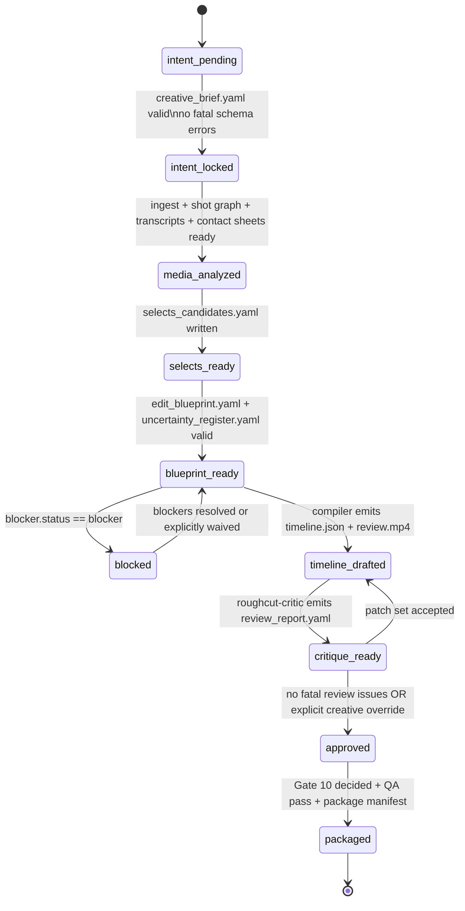

# Video OS v2 architecture

## Core decision

Remove `providers/reasoning/*`.

Reasoning is not an API provider in this repository. It is a **role runtime** that may be satisfied in one of three ways:

1. **Interactive local runtime**  
   A human is currently inside Claude Code or Codex and invokes project-scoped subagents.

2. **Automated local runtime**  
   A script uses Claude Agent SDK, Codex SDK, or `codex exec` to run the same role prompts headlessly.

3. **Remote API fallback**  
   Only used when a local runtime is unavailable and the task is purely textual / image-based reasoning.

The repository must not assume that “the session I’m chatting with right now” is a callable service endpoint.
Interactive sessions are an operator environment, not a stable service contract.

## Layering

```text
human / operator
      ↓
main agent runtime (Claude Code or Codex)
      ↓
subagents (roles)
  - intent-interviewer
  - footage-triager
  - blueprint-planner
  - roughcut-critic
      ↓
media-mcp / repo tools
      ↓
connectors (API-only capabilities)
  - gemini video understanding
  - openai speech/transcription
  - gemini multimodal embeddings
      ↓
engines (deterministic execution)
  - ffmpeg / ffprobe
  - otio
  - remotion
      ↓
artifacts (truth)
  - creative_brief.yaml
  - selects_candidates.yaml
  - edit_blueprint.yaml
  - uncertainty_register.yaml
  - timeline.json
  - review_report.yaml
```

## Repository structure

```text
video-os/
  AGENTS.md
  CLAUDE.md

  agent-src/
    roles/
      intent-interviewer.yaml
      footage-triager.yaml
      blueprint-planner.yaml
      roughcut-critic.yaml

  .claude/
    agents/
      intent-interviewer.md
      footage-triager.md
      blueprint-planner.md
      roughcut-critic.md
    commands/
      intent.md
      triage.md
      blueprint.md
      review.md
      status.md
      export.md

  .codex/
    config.toml
    agents/
      intent_interviewer.toml
      footage_triager.toml
      blueprint_planner.toml
      roughcut_critic.toml
    commands/
      intent.md
      triage.md
      blueprint.md
      review.md
      status.md
      export.md

  runtime/
    project.runtime.yaml
    compiler-defaults.yaml

  contracts/
    media-mcp.md

  schemas/
    unresolved-blockers.schema.json
    timeline-ir.schema.json
    review-patch.schema.json

  projects/
    _template/
      STYLE.md
      project_state.yaml
      01_intent/
        unresolved_blockers.yaml
      04_plan/
      05_timeline/
      06_review/
        human_notes.yaml

  scripts/
    generate_agents.py
```

## Invocation modes

### A. Interactive mode (default for early product work)

Use the current Claude Code or Codex session as the **orchestrator**.
Subagents exist only as project files plus repo instructions.
The human asks the main runtime to run the appropriate role.

Best when:
- you are still discovering the workflow
- the editor wants to inspect artifacts between stages
- prompts / artifacts are still evolving

### B. Automated local mode (for repeatable pipelines)

Use:
- Claude Agent SDK
- Codex SDK
- or `codex exec`

The code launches a runtime explicitly and passes the same role prompt + artifact paths.

Best when:
- you need overnight batch analysis
- you want CI gates
- you want reproducible job logs

### C. Remote API fallback (last resort)

Only for roles that are pure reasoning and do not depend on the local agent loop.
Avoid for primary orchestration.

## Canonical artifacts

The repository should treat these as the only source of truth:

- `creative_brief.yaml`
- `unresolved_blockers.yaml`
- `selects_candidates.yaml`
- `edit_blueprint.yaml`
- `uncertainty_register.yaml`
- `timeline.json`
- `review_report.yaml`
- `project_state.yaml`
- `human_notes.yaml`
- `STYLE.md`

Agents may propose edits.
Engines apply them.
Artifacts persist them.

## Schema strictness policy

- `timeline.json` keeps `clip.metadata` and `marker.metadata` as intentional extension points.
- All other structured canonical artifacts should use `additionalProperties: false`.

## Project state machine



Project state is persisted to `projects/*/project_state.yaml` so that
multi-session workflows can resume from the correct phase.
Each slash command reads this file on startup and advances it on completion.
Because clean approval, creative override, and partial-analysis debug override
cannot be reconstructed from filesystem state alone, `project_state.yaml` must
also persist canonical operator records:

- `approval_record`
  - `approved_by`
  - `approved_at`
  - `override_reason`
  - `artifact_versions`
- `analysis_override`
  - `approved_by`
  - `approved_at`
  - `reason`
  - `scope`
  - `artifact_version`
- `handoff_resolution`
  - `handoff_id`
  - `status`
  - `source_of_truth_decision`
  - `decided_by`
  - `decided_at`
  - `basis_report_hashes`

`project_state.yaml` must also snapshot `style_hash` and `human_notes_hash` so
reconcile can invalidate stale blueprint / review / approved states after
`STYLE.md` or `human_notes.yaml` changes.

For packaged-plane artifacts, split identity from hashes:

- `base_timeline_version`
  - canonical cross-artifact timeline identity
  - must equal approved `timeline.json.version`
- `editorial_timeline_hash`
  - hash of the approved editorial surface
  - approval binding / self-heal must use this hash
- `packaging_projection_hash`
  - fingerprint of the packaging plane projection
  - package freshness / rerun must use this hash
- `artifact_hashes.timeline_version`
  - legacy file-hash slot kept for backward compatibility
  - must not be reused as packaged-plane identity

If `project_state.yaml.handoff_resolution.source_of_truth_decision` changes after
QA or packaging, the existing `qa_report` and `package_manifest` become stale and
`current_state` must fall back to `approved`.

## Non-negotiable gates

1. **No timeline compilation if unresolved blocker exists**
2. **No final render if timeline schema fails**
3. **No final render if review report contains `fatal` issues**
4. **No agent writes final media directly**
5. **Only engines render**
6. **Only compiler mutates `timeline.json`**
7. **Agents may emit `review_patch[]`, not arbitrary ffmpeg commands**
8. **No OTIO export if stable IDs are missing or duplicated**
9. **No automatic import acceptance when unmapped edits exist**
10. **Declare source of truth in `project_state.yaml` before final render**
11. **NLE handoff is limited by capability profile**

Gates 8-11 protect the OTIO exchange boundary without promoting OTIO to canonical
status. Gate 10 records the final source-of-truth decision in
`project_state.yaml.handoff_resolution`, not in export-time manifests.

## Why the timeline IR should not be just OTIO

Use internal `timeline.json` as canonical.
Export OTIO for handoff.

Reason:
- internal IR needs AI-specific provenance, confidence, and fallback fields
- OTIO metadata can carry them, but downstream adapters may drop them
- internal compiler needs stricter invariants than editorial interchange formats

## Time representation decision

Do **not** store source clip positions only as SMPTE strings.

Canonical machine fields:
- `src_in_us`
- `src_out_us`
- `timeline_in_frame`
- `timeline_duration_frames`

Human-readable derived fields:
- `src_in_tc`
- `src_out_tc`
- `timeline_in_tc`

Validation contract:
- JSON Schema keeps `src_in_us` and `src_out_us` as non-negative integer fields.
- The validator runner must also enforce `src_in_us < src_out_us` for `selects_candidates.yaml` candidates and `timeline.json` clips.

Why:
- source frame rates can vary
- drop-frame / non-drop-frame string parsing is brittle
- compilers want integer arithmetic, not formatted strings

## Timeline compiler phases

### Phase 1. Blueprint normalization
Input:
- `creative_brief.yaml`
- `edit_blueprint.yaml`
- `selects_candidates.yaml`

Output:
- normalized beat sheet
- role quotas (`hero`, `support`, `transition`, `texture`, `dialogue`)

Notes:
- `reject` remains a triage-only classification and is not a beat quota.
- music and title treatment belong to `music_policy` / overlay-track directives, not `beats[].required_roles`.

### Phase 2. Candidate scoring
Deterministic scoring only.
Inputs:
- semantic rank from select candidates
- quality flags
- duration fit
- motif reuse limits
- adjacency penalties
- beat alignment penalties

Output:
- ranked candidate table per beat

Scoring policy:
- `motif_reuse_max`, `adjacency_penalty`, `beat_alignment_tolerance_frames`, and related deterministic scoring defaults are compiler-owned constants.
- Those values live in `runtime/compiler-defaults.yaml`.
- `creative_brief.yaml` and `edit_blueprint.yaml` may not override them.

### Phase 3. Assembly
Construct track layout:
- V1: primary narrative
- V2: support / inserts
- A1: dialogue / nat sound
- A2: music
- A3: texture / room tone

Milestone 1 note:
- `A2` may be empty in Milestone 1 while music cue contracts are still deferred.

### Phase 4. Constraint resolution
Resolve:
- overlaps
- repeated shot overuse
- invalid source ranges
- music timing conflicts
- silence / black / freeze QC conflicts

### Phase 5. Export
Emit:
- `timeline.json` (canonical) — **required in M1**
- `.otio` (handoff) — stub in M1, full implementation in M3.5
- preview render manifest for ffmpeg / remotion — minimal JSON manifest in M1, full in M3.5

### Phase 6. Critique and patch
`roughcut-critic` reads:
- `timeline.json`
- preview
- brief / blueprint

It emits:
- `review_report.yaml`
- `review_patch.json`

Compiler validates and applies patch ops one by one.

## Patch operations

Allowed patch ops:
- `replace_segment`
- `trim_segment`
- `move_segment`
- `insert_segment`
- `remove_segment`
- `change_audio_policy`
- `add_marker`
- `add_note`

Disallowed:
- raw shell command injection
- direct ffmpeg filter strings
- direct Remotion code generation
- unvalidated OTIO mutation

## media-mcp principles

The MCP is not a file browser.
It is an **evidence browser**.

Each tool must return:
- stable ids
- paths only as secondary data
- time ranges in machine form
- enough summary for the agent to reason without reading entire files

### Minimum tool set

- `media.project_summary`
- `media.list_assets`
- `media.get_asset`
- `media.open_contact_sheet`
- `media.search_segments`
- `media.peek_segment`
- `media.extract_window`
- `media.read_transcript_span`
- `media.compile_timeline`
- `media.render_preview`
- `media.run_qc`

See `contracts/media-mcp.md`.

## Agent design rules

### intent-interviewer
May write:
- `creative_brief.yaml`
- `unresolved_blockers.yaml`

Must not:
- choose clips
- edit timeline

### footage-triager
May write:
- `selects_candidates.yaml`

Must not:
- render
- change timeline
- invent narrative intent

### blueprint-planner
May write:
- `edit_blueprint.yaml`
- `uncertainty_register.yaml`

Preference interview phase:
- When `creative_brief.yaml > autonomy` is `collaborative`, the planner must
  confirm pacing, structure, and duration preferences with the human before
  finalising the blueprint.
- Confirmed preferences are recorded in `edit_blueprint.yaml > pacing.confirmed_preferences`.
- When `autonomy` is `full`, the planner decides autonomously.

Must not:
- emit ffmpeg commands
- render
- patch media directly

### roughcut-critic
May write:
- `review_report.yaml`
- `review_patch.json`

Must not:
- apply patches itself
- overwrite timeline directly

## What to build next

1. `media-mcp` server
2. `timeline-ir` validator
3. `review_patch` validator
4. deterministic compiler
5. preview render pipeline
6. critique loop
