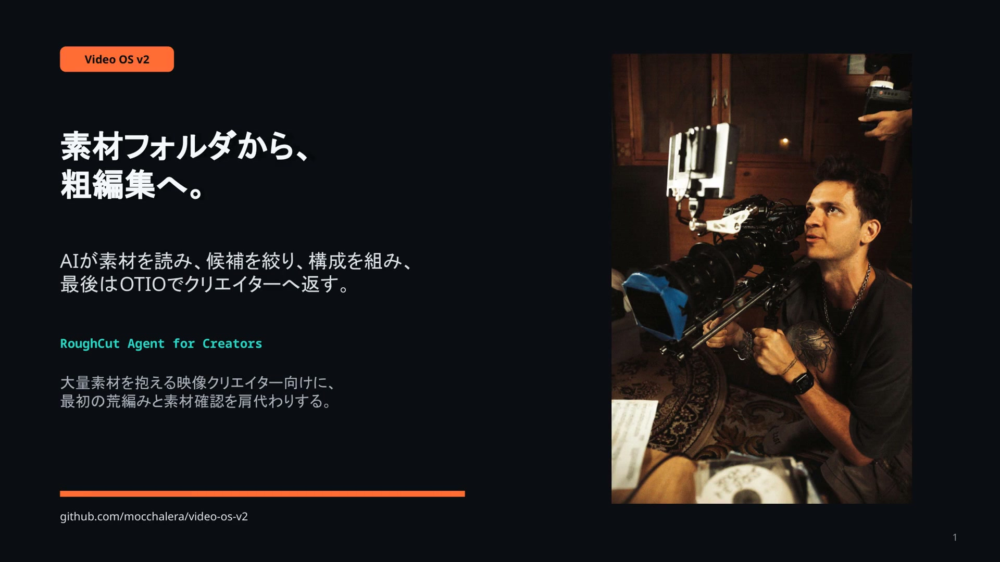
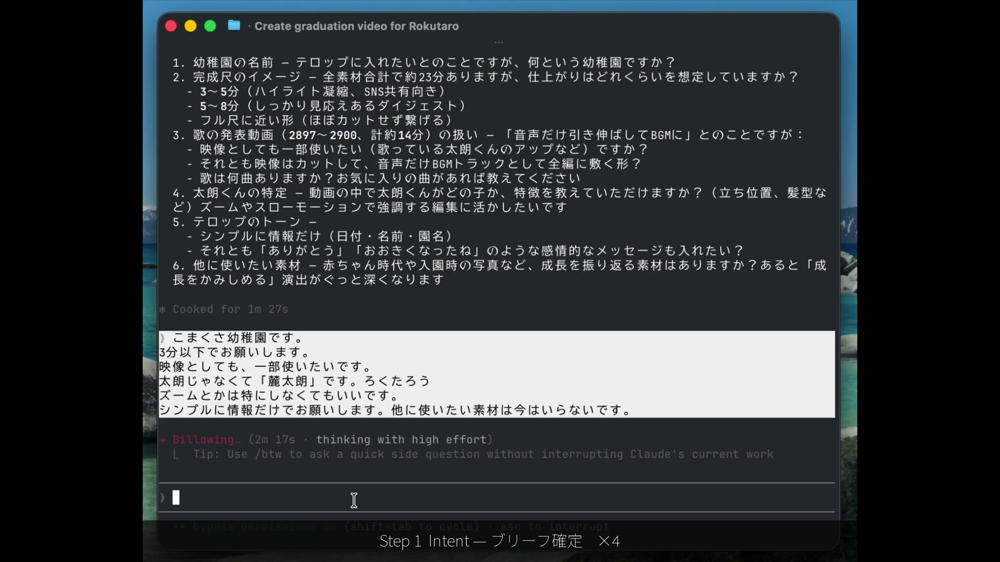
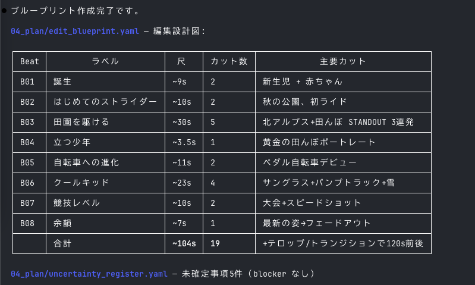
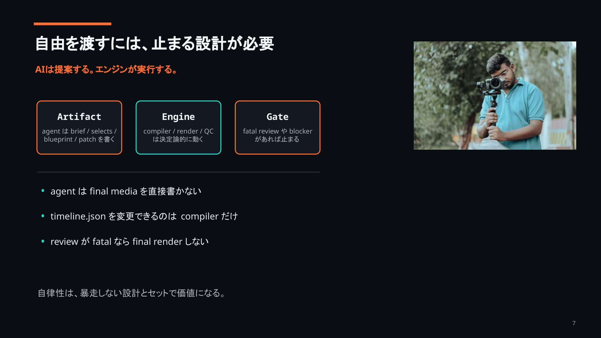

# RoughCut Agent

素材フォルダと一言の依頼で粗編集まで自走する映像編集エージェント。



## このプロジェクトについて

RoughCut Agent は、映像素材から意図整理、素材解析、候補抽出、構成設計、粗編集、自己レビューまでを artifact-driven に進める映像編集エージェントです。  
VLM/STT による解析と deterministic compiler を組み合わせ、同じ入力から同じ `timeline.json` を再現できます。  
Premiere Pro との FCP7 XML ラウンドトリップにも対応しており、AI が作った rough cut を NLE で微調整して戻せます。  
映像クリエイターや、粗編集にかかる時間を圧縮したい人向けのリポジトリです。

## 特徴

- 自律パイプライン: `intent -> analysis -> triage -> blueprint -> compile -> review`
- VLM ピーク検出: Progressive Resolution（`contact sheet -> filmstrip -> precision`）
- `content-hint` CLI: `--content-hint` で VLM に文脈情報を渡し、認識精度を補強
- 編集技法の自動選択: Transition Skill Cards + Adjacency Analyzer + Walter Murch の Rule of Six
- BGM ビートシンク: カットポイントを beat / downbeat にスナップ
- Duration Mode: `strict` / `guide` を creative brief と profile から解決。`guide` は VLM peak 保護を優先
- Premiere Pro ラウンドトリップ: FCP7 XML export / import、UXP Watcher、diff engine を実装
- アスペクト比自動対応: 最頻アスペクト比を推定し、`letterbox` / `pillarbox` を判定
- 時系列順コンパイル: `keepsake` / `event-recap` 系は chronological order を選択可能
- Schema 駆動 + Gate 制御: canonical artifacts を validate しながら進行
- Full Autonomy Mode: `autonomy.mode: full` で brief 確定後の全ゲートを自動通過。粗編集まで一気に自走

## クイックスタート

### 1. インストール

```bash
npm install
```

### 2. デモを実行

```bash
npm run demo
```

出力例:

```text
─────────────────────────────────────────────────
  RoughCut Agent — Demo (deterministic compile)
─────────────────────────────────────────────────

[1/3] Reading artifacts from projects/demo/...
  - creative_brief.yaml   (intent)
  - selects_candidates.yaml (candidates)
  - edit_blueprint.yaml   (structure)

[2/3] Running deterministic compiler (Phase 0.5 → 5)...
  Phase 0.5  Duration policy resolved
  Phase 1    Blueprint normalized
  Phase 2    Candidates scored
  Phase 3    Multi-track assembly
  Phase 4    Constraints resolved
  Phase 5    Timeline exported

[3/3] Compilation results:

  Duration mode:    guide
  Target:           28.0s
  Compiled:         28.6s
  Duration fit:     YES
  Overlaps fixed:   0
  Duplicates fixed: 0
  Invalid ranges:   0
  Output:           projects/demo/05_timeline/timeline.json

  Timeline: "Mountain Reset"
  Tracks:   2 video + 3 audio
  Clips:    14 total

  Pre-generated review (from roughcut-critic):
  Judgment:    needs_revision
  Confidence:  0.82
  Strengths:   2
  Weaknesses:  2
  Fatal:       0

─────────────────────────────────────────────────
  Demo complete. Explore projects/demo/ to see all artifacts.
─────────────────────────────────────────────────
```

### 3. 自分の素材を解析

```bash
export GEMINI_API_KEY=your-gemini-key
export GROQ_API_KEY=your-groq-key

npx tsx scripts/analyze.ts ./footage/*.mp4 \
  --project projects/my-project \
  --content-hint "子どもの自転車練習"
```

`--content-hint` は VLM prompt に文脈情報を追加し、タグ付けや peak 検出の認識精度向上に使えます。

## 完全な E2E フロー



```text
素材投入
  -> scripts/analyze.ts
  -> 03_analysis/assets.json / segments.json / transcripts / contact sheets / filmstrips / peak_analysis
  -> /intent
  -> 01_intent/creative_brief.yaml / unresolved_blockers.yaml
  -> /triage
  -> 04_plan/selects_candidates.yaml
  -> /blueprint
  -> 04_plan/edit_blueprint.yaml / uncertainty_register.yaml
  -> scripts/compile-timeline.ts
  -> 05_timeline/timeline.json / adjacency_analysis.json
  -> /review
  -> 06_review/review_report.yaml / review_patch.json
  -> /caption -> /package
  -> 07_package/* / final.mp4
```



補足:

- `runtime/commands/` には `/intent`, `/triage`, `/blueprint`, `/review`, `/caption`, `/package` の command contract が実装されています。
- `scripts/analyze.ts` では STT/VLM と VLM peak detection を実行し、`peak_analysis` を `segments.json` に書き戻します。
- `scripts/compile-timeline.ts` は deterministic compile の公開 CLI です。
- Premiere で詰めたい場合は、`timeline.json -> FCP7 XML -> Premiere -> FCP7 XML -> timeline.json` の往復が可能です。

## Premiere Pro 連携

エクスポート:

```bash
npx tsx scripts/export-premiere-xml.ts projects/my-project
```

インポート:

```bash
npx tsx scripts/import-premiere-xml.ts projects/my-project --xml edited.xml --dry-run
```

UXP プラグイン:

1. Adobe Creative Cloud から UXP Developer Tool を入れる
2. `premiere-plugin/manifest.json` を読み込む
3. Premiere Pro で `Window -> Extensions -> Video OS Watcher` を開く
4. `FCP7 XML Path` に XML のパスを入れて Watch を開始する

ラウンドトリップ diff engine は `trim_changed`, `reordered`, `deleted`, `added_unmapped` を検出します。`added_unmapped` は自動適用せず、手動レビュー前提です。

## アーキテクチャ



```text
Creative Brief
  -> Selects Candidates
  -> Edit Blueprint
  -> Deterministic Compiler
  -> timeline.json
  -> Review Report / Review Patch
  -> Package or Premiere Roundtrip
```

- Canonical Artifacts: 各ステージは YAML / JSON の canonical artifact を出力し、隠れた状態を持ちません。
- Deterministic Engine: `normalize -> score -> assemble -> trim -> resolve -> export` を純関数的に進めます。
- Self-Critique Loop: `review_report.yaml` と `review_patch.json` により rough cut を再評価できます。
- Transition Skill Cards: P0 の 5 スキル (`match_cut_bridge`, `build_to_peak`, `crossfade_bridge`, `smash_cut_energy`, `silence_beat`) を隣接クリップ単位で自動選択します。

## Agent Skills

`.agents/skills/` に定義された Agent Skill が、エージェントの判断と行動をガイドします。Claude Code / Codex CLI どちらでも同じスキルが発火します（symlink 共有）。

| スキル | 発火条件 | 役割 |
|--------|----------|------|
| `setup-environment` | 初回セットアップ、依存不足、API キー未設定 | 環境構築をステップバイステップでガイド |
| `design-intent` | 素材を渡して「編集して」、新プロジェクト開始 | ユーザーの意図をヒアリングし creative brief を作成 |
| `analyze-footage` | 素材フォルダや動画ファイルを渡されたとき | VLM/STT で素材を解析し assets.json / segments.json を生成 |
| `select-clips` | 「クリップを選んで」、triage 実行 | 素材から候補クリップを抽出・スコアリング |
| `build-blueprint` | 「構成を作って」、blueprint 実行 | ビート構造と編集構成を設計 |
| `compile-timeline` | 「タイムラインを作って」、compile 実行 | 確定的コンパイラで timeline.json を生成 |
| `review-roughcut` | 「レビューして」、粗編集の品質確認 | 自己批評ループで品質を評価・パッチ提案 |
| `export-premiere` | 「Premiere に出して」、XML エクスポート | timeline.json → FCP7 XML 変換 |
| `import-premiere` | 「Premiere から戻して」、XML インポート | FCP7 XML → timeline.json 差分検出・適用 |
| `render-video` | 「レンダリングして」、動画出力 | ffmpeg で最終動画を生成 |
| `full-pipeline` | 「全自動で」「素材から動画を作って」 | 全ステージを Gate 付きでオーケストレーション |
| `troubleshoot-error` | エラー発生時、「直して」 | エラーカタログから原因特定・復旧手順を案内 |
| `re-edit` | 「ここを変えて」「尺を短くして」 | 既存 timeline への部分的な再編集指示を処理 |

## テスト

```bash
npm test
```

2026-03-22 確認時点で `43` test files、`1450` tests がすべて通過しています。

## 技術スタック

- TypeScript / Node.js / `tsx`
- Vitest
- AJV + JSON Schema + YAML
- `ffmpeg` / `ffprobe`
- Gemini VLM / Groq STT / OpenAI STT / pyannote diarization
- OpenTimelineIO Python bridge
- FCP7 XML exporter / importer
- Premiere Pro UXP plugin

## 制限事項

- 現状の公開 CLI は `demo`, `validate`, `build`, `scripts/analyze.ts`, `scripts/compile-timeline.ts`, Premiere XML import/export が中心です。
- `/intent` などの slash command は `runtime/commands/` の command contract として実装されており、専用アプリ UI はまだありません。
- 高精度 analysis には `ffmpeg` 系ツールと API key、場合によっては Python / `opentimelineio` / `pyannote` が必要です。
- Premiere UXP plugin は手動インストールと Premiere 上での手動確認が前提です。

## ライセンス

未設定です。2026-03-22 時点でリポジトリに `LICENSE` ファイルは含まれていません。
