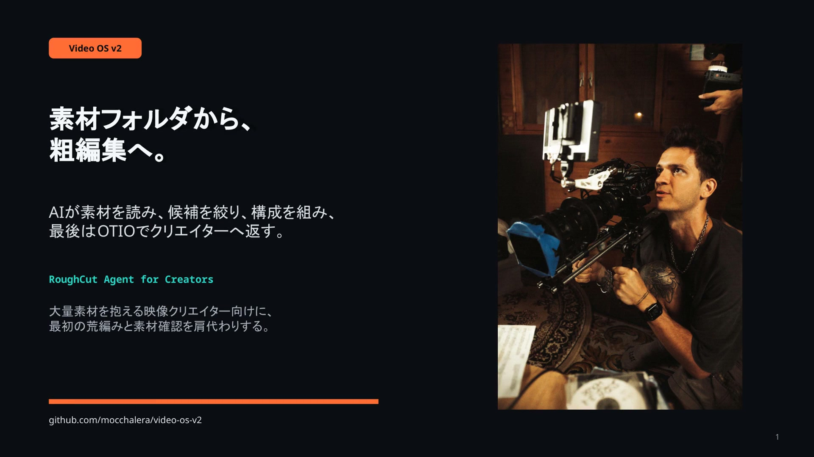
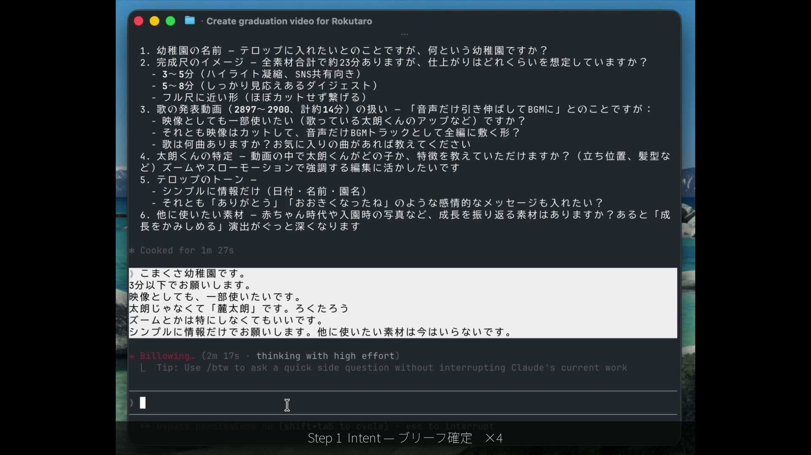
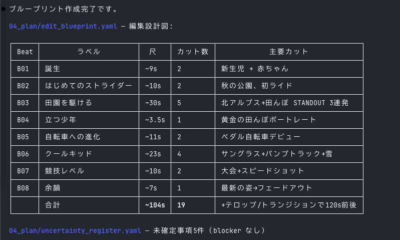
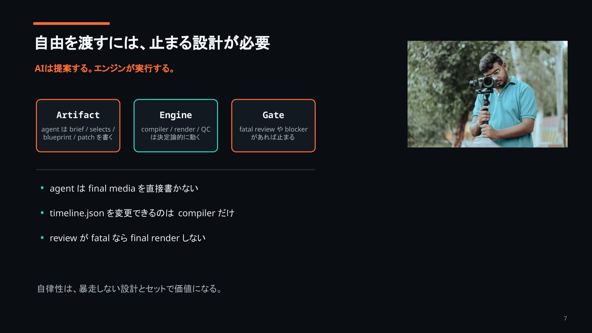

# RoughCut Agent

素材フォルダと一言の依頼から、解析・検索・粗編集・レンダー・QA 改善まで進める映像編集エージェント。



## このプロジェクトについて

RoughCut Agent は、映像素材から意図整理、素材解析、マルチモーダル検索、構成設計、粗編集、レンダー、QA 改善ループまでを artifact-driven に進める映像編集エージェントです。

Marlin-2B が映像を見て、Qwen3-VL / CLAP / E5 が素材を検索し、Claude/Codex が evidence を引用しながら rough / fine pass を作り、deterministic compiler が同じ入力から同じ `timeline.json` を再現します。

現在は複数プロジェクトの検証を通じて、`footage.db`、`timeline.json`、`render-report.json`、QA レポートなどの実 artifact を見ながら品質を上げる設計に寄せています。

Premiere Pro との FCP7 XML ラウンドトリップにも対応しており、AI が作った rough cut を NLE で微調整して戻せます。
映像クリエイターや、素材探しから粗編集の手戻りまでを短くしたい人向けのリポジトリです。

## 現行プロダクトとランタイムの責務

- `apps/macos-studio` (`VideoOSStudio`) が現行の正式なオペレーターサーフェスです。GUI と `videoos-studio-cli` は canonical artifacts を読み、必要な処理を `runtime/` と `scripts/` の entrypoint 経由で実行します。
- `editor/server` は引き続きサポートするローカル preview/API infrastructure です。exact preview、media delivery、timeline/review API、WebSocket 通知を提供し、`npm --prefix editor run server -- --project ../projects/<project-id>` で明示的に起動します。macOS Studio の起動や通常操作には不要で、Studio から自動起動・呼び出しもしません。
- `editor/shared` は preview と final render の parity contract を支える共有実装としてサポートします。
- `editor/client` はリタイア済みの旧 Web UI です。新機能・通常保守の対象ではなく、現行 UI の実装先にしないでください。履歴参照のため source は残しています。

CI はこの境界に合わせ、`macos-studio` job で SwiftPM tests と CLI smoke、`editor-server` job で `editor/server` + `editor/shared` の typecheck、Node test job で preview parity と server security regression を実行します。`editor/client` の build は意図的に required CI に含めていません。詳細は [`editor/README.md`](editor/README.md) と [`ARCHITECTURE.md`](ARCHITECTURE.md) を参照してください。

現行正を確認するときは、まず [`docs/CURRENT_ARCHITECTURE.md`](docs/CURRENT_ARCHITECTURE.md) を読み、続けて [`docs/DECISIONS.md`](docs/DECISIONS.md)、[`docs/PIPELINE_STATES.md`](docs/PIPELINE_STATES.md)、[`docs/SECURITY_MODEL.md`](docs/SECURITY_MODEL.md)、[`docs/RELEASE_CHECKLIST.md`](docs/RELEASE_CHECKLIST.md)、[`docs/DEPRECATED.md`](docs/DEPRECATED.md) を参照してください。過去の design / review 文書は履歴資料であり、これらの現行正、schema、実行コード、CI を上書きしません。

## 特徴

- 自律パイプライン: `intent -> analysis -> footage DB -> retrieval -> rough/fine planning -> compile -> render -> QA loop`
- 3 モダリティ検索: Qwen3-VL visual 2048-dim、E5/Qwen text 384/2048-dim、CLAP audio 512-dim を同じ検索レイヤで扱う
- マルチモーダル footage DB: SQLite + FTS5 + `embedding_models` + `segment_embeddings` で、モデル ID / 次元 / runner / preprocess を追跡
- Visual pre-selection retrieval: brief の visual intent から Qwen3-VL hybrid search を走らせ、rough pass の prompt に evidence を注入
- Audio pre-selection retrieval: brief の audio intent から CLAP hybrid search を走らせ、音の質感・環境音・ムードの候補を prompt に注入
- Marlin-2B primary VLM: Apple Silicon / ローカル worker で video-native な scene / event / peak analysis を実行
- VLM ピーク検出: Progressive Resolution（`contact sheet -> filmstrip -> precision`）と Marlin event を使って、編集上おいしい瞬間を候補化
- `content-hint` CLI: `--content-hint` で VLM に文脈情報を渡し、認識精度を補強
- Scene continuity ordering: timestamp clustering と Qwen visual coherence による greedy chain で、同一シーンや見た目のつながりを保つ
- QA auto-improvement loop: `render -> Marlin QA -> brief alignment -> issue detection -> fix proposal -> apply -> recompile -> rerender` を最大 3 iteration で実行
- Render duration accounting: expected / actual render duration、gap、xfade overlap、source clamp を `render-report.json` で検証
- 汎用エンディング処理: 最終発話後の素材ハンドルを余韻として残し、音声フェードと任意の黒／白フェードを決定論的に適用
- 編集技法の自動選択: Transition Skill Cards + Adjacency Analyzer + Walter Murch の Rule of Six
- BGM ビートシンク: カットポイントを beat / downbeat にスナップ
- Duration Mode: `strict` / `guide` を creative brief と profile から解決。`guide` は VLM peak 保護を優先
- Premiere Pro ラウンドトリップ: FCP7 XML export / import、UXP Watcher、diff engine を実装
- アスペクト比自動対応: 最頻アスペクト比を推定し、`letterbox` / `pillarbox` を判定
- 時系列順コンパイル: `keepsake` / `event-recap` 系は chronological order を選択可能
- 長尺イベント削減: `longform-event` は2時間級の固定カメラ素材を発話窓と章に分け、不要区間を記録しながら約1時間の時系列タイムラインへ決定論的に圧縮
- Schema 駆動 + Gate 制御: canonical artifacts を validate しながら進行
- Full Autonomy Mode: `autonomy.mode: full` で brief 確定後の確認ゲートを自動通過し、粗編集まで自走
- ローカル推論 / 埋め込み実行: Qwen3-VL、CLAP、E5、Marlin はローカル実行を前提にし、外部 embedding API は不要
- Fail-open: Qwen / CLAP / Marlin のローカルモデルが無い場合も、既存の E5 / FTS / deterministic path を壊さない

## クイックスタート

### 1. インストール

```bash
npm install
```

### 2. 環境変数とローカルモデルを用意

```bash
cp .env.example .env.local
```

`.env.local` は Git 管理対象外です。公開 issue や PR に API キー、素材ファイル、生成済み動画を含めないでください。

埋め込み検索はローカルモデルで動くため外部 API キーは不要です。Gemini / Groq / OpenAI / pyannote などの外部解析を使う場合だけ、対応するキーを `.env.local` に設定してください。

Qwen3-VL と CLAP は任意ですが、現在の推奨フローでは有効化します。smoke test は Python venv を作り、ローカル cache にある model weight だけを使います。

```bash
bash scripts/smoke-test-qwen3vl.sh
bash scripts/smoke-test-clap.sh
```

ローカル model cache がまだ無い場合、smoke test は失敗します。その場合も E5 / FTS5 中心の検索と deterministic compile は継続できます。

### 3. デモを実行

```bash
npm run demo
```

出力例:

```text
─────────────────────────────────────────────────
  RoughCut Agent — Demo (deterministic compile)
─────────────────────────────────────────────────

[1/3] Reading artifacts from projects/demo/...
  - creative_brief.yaml   (intent)
  - selects_candidates.yaml (candidates)
  - edit_blueprint.yaml   (structure)

[2/3] Running deterministic compiler (Phase 0.5 → 5)...
  Phase 0.5  Duration policy resolved
  Phase 1    Blueprint normalized
  Phase 2    Candidates scored
  Phase 3    Multi-track assembly
  Phase 4    Constraints resolved
  Phase 5    Timeline exported

[3/3] Compilation results:

  Duration mode:    guide
  Target:           28.0s
  Compiled:         28.6s
  Duration fit:     YES
  Overlaps fixed:   0
  Duplicates fixed: 0
  Invalid ranges:   0
  Output:           projects/demo/05_timeline/timeline.json

  Timeline: "Mountain Reset"
  Tracks:   2 video + 3 audio
  Clips:    14 total

  Pre-generated review (from roughcut-critic):
  Judgment:    needs_revision
  Confidence:  0.82
  Strengths:   2
  Weaknesses:  2
  Fatal:       0

─────────────────────────────────────────────────
  Demo complete. Explore projects/demo/ to see all artifacts.
─────────────────────────────────────────────────
```

### 4. 自分の素材を full-pipeline で実行

```bash
npm run full-pipeline -- \
  --project my-project \
  --source-dir /path/to/footage \
  --content-hint "子どもの自転車練習"
```

`/full-pipeline` の npm equivalent です。プロジェクトが無ければ `projects/_template/` から作成し、`analyze -> footage DB -> editorial-pipeline` を単一コマンドで進めます。主な出力は `03_analysis/assets.json`、`03_analysis/search/footage.db`、`04_plan/selects_candidates.yaml`、`04_plan/edit_blueprint.yaml`、`05_timeline/timeline.json`、`09_output/rough-cut.mp4`、`09_output/render-report.json`、QA レポートです。

実行中は stage ごとに progress / ETA が出ます。TTY では 1 行更新、非 TTY では行追記です。

```text
[3/10] triage 実行中... 経過 1m32s / 推定残り ~4m (全体 ~7m)
```

各実行後、stage 別の実測時間を `projects/my-project/03_analysis/pipeline-timings.json` に追記します。次回実行ではこの履歴を読んで ETA を推定し、初回は `segments.json` のセグメント数を使った粗い見積もりにフォールバックします。どちらも無い stage は `計測中` と表示します。

長尺イベントでは `creative_brief.yaml` の `editorial.profile_hint` を `longform-event`、`project.runtime_target_sec` を希望尺（例: `3600`）に設定します。公式 `full-pipeline` は transcript-first の削減計画へ自動分岐し、章カバレッジや尺を満たせなければコンパイル前に停止します。設定と artifact 契約は [`docs/longform-event-mode.md`](docs/longform-event-mode.md) を参照してください。

### 5. パッケージまで進める

```bash
npm run package -- projects/my-project
```

`npm run full-pipeline` は粗編集と QA loop までを主導します。final package / handoff artifact が必要な場合は、承認・caption/music 前提を満たしたあと F-0033 の `npm run package` を出口にしてください。

## CLI EntryPoints

公開サポートしている主要 CLI は次の通りです。

| Entry point | Purpose | Command |
|-------------|---------|---------|
| `full-pipeline` | init / analyze / footage DB / planning / compile / render / QA を単一実行 | `npm run full-pipeline -- --project <project-id> --source-dir /path/to/footage [--content-hint "..."]` |
| `init-project` | 新規プロジェクトの雛形作成 | `npx tsx scripts/init-project.ts <project-id> [--source-dir /path/to/footage]` |
| `analyze` | 素材解析と `03_analysis/` 生成 | `npx tsx scripts/analyze.ts <source-files...> --project projects/<project-id>` |
| `build-footage-db` | SQLite / FTS5 / Qwen3-VL / CLAP embedding DB 生成 | `npx tsx scripts/build-footage-db.ts --project projects/<project-id> [--qwen3vl] [--clap-audio]` |
| `editorial-pipeline` | retrieval → planning → compile → render → QA の統合実行 | `npx tsx scripts/editorial-pipeline.ts --project projects/<project-id> [--skip-fine] [--skip-render] [--skip-qa]` |
| `render-rough-cut` | `timeline.json` を BGM 付き MP4 にレンダーし duration parity を記録 | `npx tsx scripts/render-rough-cut.ts --project projects/<project-id> [--output path] [--bgm path]` |
| `promo-finish` | transcript aligned 字幕、最後の余韻、音声/映像フェード付き宣材MP4を生成 | `npm run promo-finish -- --project projects/<project-id> [--output path]` |
| `package` | approved rough cut から final package / QA manifest を作成 | `npm run package -- projects/<project-id> [options]` |
| `status` | Gate 状態と次アクション確認 | `npx tsx scripts/status.ts projects/<project-id>` |
| `compile` | `timeline.json` と preview manifest 生成 | `npx tsx scripts/compile-timeline.ts projects/<project-id>` |
| `preview` | preview clip / overview 生成 | `npx tsx scripts/preview-segment.ts projects/<project-id> [--beat <beat-name>]` |
| `export-premiere` | Premiere 向け FCP7 XML 出力 | `npx tsx scripts/export-premiere-xml.ts projects/<project-id>` |
| `import-premiere` | Premiere で編集した XML の差分読込 | `npx tsx scripts/import-premiere-xml.ts projects/<project-id> --xml edited.xml [--dry-run]` |
| `smoke-test-qwen3vl.sh` | Qwen3-VL local worker / 2048-dim embedding の確認 | `bash scripts/smoke-test-qwen3vl.sh` |
| `smoke-test-clap.sh` | CLAP local worker / 512-dim audio embedding の確認 | `bash scripts/smoke-test-clap.sh` |

## Advanced / ステージ個別実行

`npm run full-pipeline` が正式デフォルトです。stage を切り分けてデバッグしたい場合だけ、従来の個別コマンドを使います。

### 1. プロジェクトを初期化

```bash
npx tsx scripts/init-project.ts my-project --source-dir /path/to/footage
```

`projects/_template/` を元に `projects/my-project/` を作成し、`project_id` を埋めます。`--source-dir` を付けると `projects/my-project/02_media/source` に素材フォルダへのシンボリックリンクを作成します。

### 2. 素材を解析

```bash
npx tsx scripts/analyze.ts \
  projects/my-project/02_media/source/* \
  --project projects/my-project \
  --content-hint "子どもの自転車練習"
```

必要に応じて glob を `*.mp4` や `*.MOV` に狭めてください。`--source-dir` を使わずに初期化した場合は、`projects/my-project/02_media/source/*` を `/path/to/footage/*` に置き換えてください。`--content-hint` は VLM prompt に文脈情報を追加し、タグ付けや peak 検出の認識精度向上に使えます。

### 3. Footage DB を構築

```bash
npx tsx scripts/build-footage-db.ts \
  --project projects/my-project \
  --embedding-policy auto \
  --qwen3vl \
  --clap-audio
```

`projects/my-project/03_analysis/search/footage.db` に SQLite / FTS5 / embedding rows を作ります。Qwen3-VL や CLAP が使えない場合は warning を残し、利用可能な検索 channel だけで続行します。

### 4. Editorial pipeline を実行

```bash
npx tsx scripts/editorial-pipeline.ts --project projects/my-project --qa
```

このコマンドは visual / audio retrieval、rough pass、fine pass、compile、render、QA improvement loop を順に実行します。主な出力は `04_plan/selects_candidates.yaml`、`04_plan/edit_blueprint.yaml`、`04_plan/visual_search_trace.json`、`05_timeline/timeline.json`、`09_output/rough-cut.mp4`、`09_output/render-report.json` です。

## 完全な E2E フロー



```text
素材投入
  -> scripts/analyze.ts
  -> 03_analysis/assets.json / segments.json / transcripts / marlin_events.json / contact sheets / filmstrips / peak_analysis
  -> scripts/build-footage-db.ts
  -> 03_analysis/search/footage.db
     - SQLite structured metadata
     - FTS5 text index
     - embedding_models / segment_embeddings
     - E5 text + Qwen3-VL visual/text + CLAP audio
  -> 01_intent/creative_brief.yaml / unresolved_blockers.yaml
  -> Visual / Audio Retrieval
  -> 04_plan/visual_search_trace.json
  -> Rough Pass
  -> 04_plan/selects_candidates.yaml
  -> Fine Pass
  -> 04_plan/edit_blueprint.yaml / uncertainty_register.yaml
  -> scripts/compile-timeline.ts
  -> 05_timeline/timeline.json / adjacency_analysis.json
  -> scripts/render-rough-cut.ts
  -> 09_output/rough-cut.mp4 / render-report.json
  -> QA Loop
     -> Marlin QA / brief alignment
     -> issue detection / fix proposals
     -> apply / recompile / rerender (max 3 iterations)
  -> 06_review/* / 07_package/* / 09_output/*
```



補足:

- `runtime/commands/` には `/intent`, `/triage`, `/blueprint`, `/review`, `/caption`, `/package` の command contract が実装されています。
- `scripts/analyze.ts` では STT/VLM と VLM peak detection を実行し、`peak_analysis` を `segments.json` に書き戻します。
- `scripts/build-footage-db.ts` は project-local の検索 DB を作り、Qwen3-VL / CLAP が無い場合も fail-open で進みます。
- `scripts/editorial-pipeline.ts` は retrieval、rough/fine pass、compile、render、QA improvement loop を統合します。
- `scripts/compile-timeline.ts` は deterministic compile の公開 CLI です。scene continuity ordering と visual coherence cache がある場合はコンパイル時に利用します。
- Premiere で詰めたい場合は、`timeline.json -> FCP7 XML -> Premiere -> FCP7 XML -> timeline.json` の往復が可能です。

## Premiere Pro 連携

エクスポート:

```bash
npx tsx scripts/export-premiere-xml.ts projects/my-project
```

インポート:

```bash
npx tsx scripts/import-premiere-xml.ts projects/my-project --xml edited.xml --dry-run
```

UXP プラグイン:

1. Adobe Creative Cloud から UXP Developer Tool を入れる
2. `premiere-plugin/manifest.json` を読み込む
3. Premiere Pro で `Window -> Extensions -> Video OS Watcher` を開く
4. `FCP7 XML Path` に XML のパスを入れて Watch を開始する

ラウンドトリップ diff engine は `trim_changed`, `reordered`, `deleted`, `added_unmapped` を検出します。`added_unmapped` は自動適用せず、手動レビュー前提です。

## 書き出し先

現在の rough-cut renderer は次のパスに MP4 と duration accounting を出力します。

```text
projects/<project-id>/09_output/rough-cut.mp4
projects/<project-id>/09_output/render-report.json
```

`07_package/` は QA、manifest、音声 stem、caption sidecar などの内部パッケージ用ディレクトリです。公開・納品用に固定した成果物は `/package` または後段の publish flow で `09_output/final.mp4` に発行する想定です。

## アーキテクチャ



```text
Creative Brief
  -> Visual/Audio Retrieval (Qwen3-VL + CLAP pre-selection)
  -> Rough Pass (LLM with multimodal evidence)
  -> Fine Pass (LLM refinement)
  -> Deterministic Compiler (scene continuity + visual coherence)
  -> Render (ffmpeg xfade + BGM)
  -> QA Loop (Marlin QA -> fix proposals -> apply -> recompile -> rerender)
  -> Final Output
```

- 2-model architecture: Marlin が「目」として scene / event / peak を読み、Claude/Codex が「脳」として evidence を使って編集判断を行います。Qwen3-VL / CLAP / E5 は planner ではなく検索 channel です。
- 3-modality search: visual、text、audio を同じ footage DB と検索 API で扱います。ただし Qwen / E5 / CLAP のベクトル空間は混ぜず、`embedding_models.id` 単位で比較し、score fusion で統合します。
- Deterministic Compiler: `normalize -> score -> assemble -> trim -> resolve -> export` を純関数的に進め、timestamp clustering と Qwen visual coherence cache がある場合は scene continuity ordering に使います。
- QA Loop: Marlin QA と brief alignment から issue を検出し、bounded fixes を提案・適用・再コンパイル・再レンダーします。最大 3 iteration、score 低下、duration/fill/render parity regression で停止します。
- Canonical Artifacts: 各ステージは YAML / JSON の canonical artifact を出力し、隠れた状態を持ちません。
- Transition Skill Cards: P0 の 5 スキル (`match_cut_bridge`, `build_to_peak`, `crossfade_bridge`, `smash_cut_energy`, `silence_beat`) を隣接クリップ単位で自動選択します。

## Agent Skills

`.agents/skills/` に定義された Agent Skill が、エージェントの判断と行動をガイドします。Claude Code / Codex CLI どちらでも同じスキルが発火します（symlink 共有）。

| スキル | 発火条件 | 役割 |
|--------|----------|------|
| `setup-environment` | 初回セットアップ、依存不足、API キー未設定 | 環境構築をステップバイステップでガイド |
| `design-intent` | 素材を渡して「編集して」、新プロジェクト開始 | ユーザーの意図をヒアリングし creative brief を作成 |
| `analyze-footage` | 素材フォルダや動画ファイルを渡されたとき | VLM/STT で素材を解析し assets.json / segments.json を生成 |
| `select-clips` | 「クリップを選んで」、triage 実行 | 素材から候補クリップを抽出・スコアリング |
| `build-blueprint` | 「構成を作って」、blueprint 実行 | ビート構造と編集構成を設計 |
| `compile-timeline` | 「タイムラインを作って」、compile 実行 | 確定的コンパイラで timeline.json を生成 |
| `review-roughcut` | 「レビューして」、粗編集の品質確認 | 自己批評ループで品質を評価・パッチ提案 |
| `export-premiere` | 「Premiere に出して」、XML エクスポート | timeline.json → FCP7 XML 変換 |
| `import-premiere` | 「Premiere から戻して」、XML インポート | FCP7 XML → timeline.json 差分検出・適用 |
| `render-video` | 「レンダリングして」、動画出力 | ffmpeg で最終動画を生成 |
| `full-pipeline` | 「全自動で」「素材から動画を作って」 | 全ステージを Gate 付きでオーケストレーション |
| `troubleshoot-error` | エラー発生時、「直して」 | エラーカタログから原因特定・復旧手順を案内 |
| `re-edit` | 「ここを変えて」「尺を短くして」 | 既存 timeline への部分的な再編集指示を処理 |

## テスト

```bash
npm run validate
npm test
npm run build
```

CI でも `validate -> test -> build` を実行します。現在は Vitest ベースで 2370+ 件のテストがあり、件数は開発中に変動します。正確な件数は `npm test` の出力を確認してください。
`npm run validate` は公開デモ `projects/demo` を検証します。checkout 内のローカル作業プロジェクトも含めて確認したい場合は `npm run validate:all-local` を使ってください。

## OSS と貢献

- ライセンス: [MIT](LICENSE)
- 貢献ガイド: [CONTRIBUTING.md](CONTRIBUTING.md)
- セキュリティ報告: [SECURITY.md](SECURITY.md)
- 公開前チェックリスト: [docs/oss-readiness.md](docs/oss-readiness.md)

公開リポジトリに含める project data は `projects/_template/` と `projects/demo/` のみです。`projects/*`, `tmp/`, `.env.local`, 生成動画、contact sheet、ローカル解析結果は checkout 固有の作業データとして扱います。

## 技術スタック

- TypeScript / Node.js / `tsx`
- Vitest
- AJV + JSON Schema + YAML
- SQLite / FTS5 / `better-sqlite3`
- `ffmpeg` / `ffprobe`
- Qwen3-VL-Embedding-2B（visual / text embedding、2048-dim）
- CLAP `laion/clap-htsat-fused`（audio embedding、512-dim）
- Marlin-2B（local video VLM）
- `Xenova/multilingual-e5-small`（text embedding、384-dim）
- Python JSONL workers（Qwen3-VL / CLAP / Marlin local inference）
- Gemini VLM / Groq STT / OpenAI STT / pyannote diarization
- OpenTimelineIO Python bridge
- FCP7 XML exporter / importer
- Premiere Pro UXP plugin

## 制限事項

- Qwen3-VL / CLAP / Marlin の real model 実行には Python venv とローカル model cache が必要です。未設定時は warning を出して、利用可能な channel だけで続行します。
- Qwen3-VL mixed input、Qwen reranker、before/after 両側を使う visual bridge search は設計済みですが、公開 API としては段階的に拡張中です。
- CLAP は音の質感・環境音・ムード検索に使います。発話内容そのものの検索は transcript / FTS5 / E5 / Qwen text channel が担当します。
- QA improvement loop は bounded auto-fix です。創作判断を完全に置き換えるものではなく、score 低下や duration parity 失敗では停止します。
- `/intent` などの slash command は `runtime/commands/` の command contract として実装されており、専用アプリ UI はまだありません。
- 高精度 analysis には `ffmpeg` 系ツールと API key、場合によっては Python / `opentimelineio` / `pyannote` が必要です。
- Premiere UXP plugin は手動インストールと Premiere 上での手動確認が前提です。

## ライセンス

MIT License. 詳細は [LICENSE](LICENSE) を参照してください。
