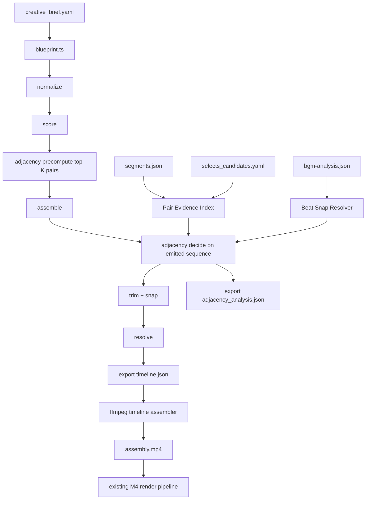

# カット繋ぎ編集技法システム 設計書

## 1. 目的

Video OS v2 の compiler に、隣接クリップ間の編集意図を deterministic に付与する。
現状の compiler は beat ごとに候補を独立採点し、そのまま時系列に並べるため、
以下の欠点がある。

- 隣接 2 クリップが「なぜその切り方なのか」を artifact として説明できない
- `match_cut` / `J-cut` / `L-cut` / `silence beat` のような編集知が timeline に残らない
- BGM の拍とカット点が独立しており、音楽主導の気持ちよさが出ない
- 素材品質優先と尺厳守のモード差が compiler に存在しない

本設計は、旧 `video-edit-agent` の Editing Skill System をそのまま移植せず、
v2 の schema-driven / artifact-first / deterministic compiler に合わせて再設計する。

## 2. スコープ

### 2.1 この設計で入れるもの

- JSON + TypeScript ベースの Transition Skill Card
- 隣接ペア専用の `Adjacency Analyzer`
- `segments.json.peak_analysis` を使う pair evidence 正規化
- `bgm-analysis.json` と beat/downbeat snap
- `creative_brief.project.duration_mode`
- `edit_blueprint.duration_policy`
- `timeline.json` への transition surface 追加
- ffmpeg render への transition 変換ルール
- P0/P1 分割、フォールバック、テスト戦略

### 2.2 この設計で入れないもの

- 旧 repo の `Resolver -> Critic -> Reviser` をそのまま再現すること
- 任意個の within-beat multi-clip montage IR
- thread interleave が前提の完全な `crosscut_suspense`
- NLE 全般の transition/plugin 再実装
- remote API 依存の online cut optimization

## 3. 前提と設計判断

### 3.1 前提

- canonical timeline artifact は引き続き `05_timeline/timeline.json`
- canonical timeline schema file は `schemas/timeline-ir.schema.json`
- compiler は引き続き pure / deterministic / no LLM
- M4.5 の `runtime/editorial/skills/*.yaml` は「どの skill を有効化するか」の高レベル registry として残す
- 本設計で追加するのは「どう実行するか」の compile-owned contract
- P0 で transition decision を出す対象 lane は `V1` を正とし、audio split は対応する `A1` にだけ適用する
- `A1` は `V1` と同じ cut frame を強制しない。`j_cut` / `l_cut` では実際の overlap を `A1` clip geometry と
  incoming clip `metadata.editorial.audio_continuity.overlap_from_prev_*` に正規化する
- `V2`, `A2`, `A3` は P0 では plain cut を継続し、P1 以降で必要な lane ごとの差分実装を入れる
- BGM beat grid の canonical artifact は `07_package/audio/bgm-analysis.json` とし、
  compiler は `07_package/music_cues.json.music_asset.analysis_ref` 経由でのみ参照する

### 3.2 重要な判断

1. 既存 YAML skill registry は profile/policy 由来の activation に使い続ける  
   ただし隣接カットの実行条件・重み・render 効果は別の JSON card に分離する。

2. 新しい判断単位は `adjacent_pair` を基本にする  
   旧 repo の scene-level skill も同じ card schema に乗せる。P0 は `adjacent_pair` 実行を基本としつつ、
   `build_to_peak` だけは scene-bias を `pair_bonus_prev` として先行導入する。

3. raw artifact から直接 free-form 条件を読むのではなく、一度 `PairEvidence` に正規化する  
   skill card は `PairEvidence` に対して typed predicate を評価する。

4. timeline には clip と transition を別 surface で持つ  
   clip local な zoom と、clip 間の transition を同じ field に詰め込まない。

5. fail-open を徹底する  
   peak / BGM / B-roll / reaction signal が不足しても compile は止めず、`cut` または `crossfade` に降格する。

## 4. 現状との差分

### 4.1 既存 M4.5 で活かせるもの

- `active_editing_skills`
- `resolved_profile` / `resolved_policy`
- `candidate_ref`
- `editorial_signals`
- `trim_hint`
- `peak_analysis`
- `clip.metadata.editorial`

### 4.2 既存 M4.5 のままでは足りないもの

- skill score が candidate ごとの差を作っておらず、ranking をほぼ変えない
- `timeline.json` に transition surface がない
- render path が transition-aware な `assembly.mp4` を生成しない
- `segments.json.peak_analysis` に adjacency 用の visual signature が足りない
- duration tolerance が profile / delivery context に応じて切り替わらない

## 5. 全体アーキテクチャ



## 6. Skill Card の v2 移植

### 6.1 配置

- 高レベル activation: `runtime/editorial/skills/*.yaml` のまま維持
- 実行契約: `runtime/editorial/transition-skills/*.json` を新設
- schema: `schemas/transition-skill-card.schema.json`
- TypeScript: `runtime/compiler/transition-types.ts`
- JSON card の `id` は既存 YAML registry の `skill_id` と完全一致させる

### 6.2 TypeScript 型

```ts
export type TransitionType =
  | "cut"
  | "crossfade"
  | "j_cut"
  | "l_cut"
  | "match_cut"
  | "fade_to_black";

export type SkillScope = "adjacent_pair" | "scene_span";
export type DurationMode = "strict" | "guide";

export interface MurchWeights {
  emotion: number;
  story: number;
  rhythm: number;
  eye_trace: number;
  plane_2d: number;
  space_3d: number;
}

export interface Predicate {
  path: string;
  op: "eq" | "neq" | "gt" | "gte" | "lt" | "lte" | "in" | "contains";
  value: string | number | boolean | string[];
}

export interface PredicateGroup {
  all?: Predicate[];
  any?: Predicate[];
}

export interface ViabilityGate {
  id: string;
  predicate: PredicateGroup;
  failure_reason: string;
}

export interface FallbackStep {
  kind: "same_asset_punch_in" | "crossfade" | "freeze_hold" | "hard_cut" | "skip_skill";
  lower_to: "transition" | "clip_effect" | "marker_only";
  transition_type?: TransitionType;
  crossfade_sec?: number;
  hold_side?: "left" | "right";
  hold_frames?: number;
  punch_in_scale?: number;
}

export interface TransitionEffects {
  transition_type: TransitionType;
  crossfade_sec?: number;
  audio_overlap_sec?: number; // authoring intent; compiler normalizes to overlap_from_prev_* on A1
  zoom?: {
    enabled: boolean;
    start_scale: number;
    end_scale: number;
    anchor?: "face" | "center";
  };
  beat_snap?: "none" | "beat" | "downbeat";
  snap_anchor?: "cut_frame" | "transition_center";
}

export interface TransitionSkillCard {
  id: string;
  version: "1";
  scope: SkillScope;
  phase: "p0" | "p1";
  intent: string;
  audience_effect: string;
  murch_weights: MurchWeights;
  min_score_threshold: number;
  when: PredicateGroup;
  avoid_when?: PredicateGroup;
  minimum_viable: ViabilityGate[];
  fallback_order: FallbackStep[];
  pipeline_effects: TransitionEffects;
}
```

### 6.3 JSON 化の理由

- compiler が schema validation した上で deterministic に読める
- M4.5 の YAML registry と役割分離できる
- `when` / `avoid_when` を prose ではなく typed predicate に落とせる
- P0/P1 の phase flag を card 単位で固定できる

`min_score_threshold` は skill 採用可否の下限であり、card ごとの canonical field とする。
JSON card では明示記述を正としつつ、loader helper `resolveSkillThreshold(card)` は
後方互換のため `card.min_score_threshold` 不在時のみ `0.3` を補完し、`0..1` に clamp する。

### 6.4 Murch weights の保持方法

旧 repo の優先順位はそのまま保持する。

```
emotion > story > rhythm > eye_trace > plane_2d > space_3d
```

ただし v2 では prose critic ではなく `PairEvidence` の各軸スコアに変換する。

```ts
skill_score =
  emotion   * axis_score.emotion +
  story     * axis_score.story +
  rhythm    * axis_score.rhythm +
  eye_trace * axis_score.eye_trace +
  plane_2d  * axis_score.plane_2d +
  space_3d  * axis_score.space_3d;
```

軸スコアの元データは以下で固定する。ここで使う値はすべて `0..1` に正規化した
`PairEvidence` field であり、未定義の prose 名は残さない。

| axis | v2 evidence |
| --- | --- |
| emotion | `outgoing_afterglow_score`, `incoming_reaction_score`, `effective_peak_type`, `effective_peak_strength_score`, `energy_delta_score` |
| story | `semantic_cluster_change`, `motif_overlap_score`, `setup_payoff_relation_score` |
| rhythm | `outgoing_silence_ratio`, `cadence_fit_score`, `bgm_snap_distance_frames` |
| eye_trace | `visual_tag_overlap_score`, `motion_continuity_score` |
| plane_2d | `shot_scale_continuity_score`, `composition_match_score` |
| space_3d | `axis_consistency_score`, `axis_break_readiness_score` |

P0 では `plane_2d` と `space_3d` の一部 signal が不足するため、
未提供時は中立値 `0.5` を入れる。これにより P0 skill が過剰に axis 系へ寄らない。

`resolveAxisScores(PairEvidence)` は compiler 内の pure helper として閉じる。
P0 で中立値 `0.5` を許すのは `composition_match_score`,
`axis_consistency_score`, `axis_break_readiness_score`, `shot_scale_continuity_score`
だけであり、emotion / story / rhythm の signal 欠損を neutral で隠さない。

`effective_peak_type` は `resolveEffectivePeakType()` で閉じる。
`effective_peak_strength_score = max(left_peak_strength_score, right_peak_strength_score)` とし、
最大値を持つ側の `peak_type` を pair の代表値として採用する。
同値 tie の場合は `left` 優先、type が欠けている場合は同値群の中で最初に defined な type を採る。
`resolveEmotionAxisScore()` と `resolveAxisBreakReadiness()` は raw `left/right_peak_type` を直接見ず、
この pair-level の `effective_peak_type` / `effective_peak_strength_score` だけを参照する。

### 6.5 旧 skill からの移植方針

#### P0 core で実装する 4 枚

| skill_id | 理由 |
| --- | --- |
| `match_cut_bridge` | 隣接 visual similarity 判定の核。`peak_analysis` を活かしやすい |
| `smash_cut_energy` | peak type と energy delta の組み合わせが明快 |
| `silence_beat` | closing / afterglow / fade-to-black の基盤になる |
| `build_to_peak` | B-roll only fixture でも scene tension を作れる。`sample-v3` の主戦場に近い |

P0 は `runtime/editorial/matrix.yaml` の現状に合わせ、
B-roll / scenic 系で効く skill を先に閉じる。`j_cut_lead_in` / `l_cut_reaction_hold` は
dialogue-heavy profile では重要だが、`A1` overlap contract が未整備なまま先行させると
downstream timing を壊すため P1a に回す。

#### P1a で実装する clip-level 残り

- `cutaway_repair`
- `b_roll_bridge`
- `j_cut_lead_in`
- `l_cut_reaction_hold`
- `punch_in_emphasis`
- `talking_head_pacing`
- `axis_hold_dialogue`
- `deliberate_axis_break`
- `shot_reverse_reaction`

#### P1 後半で実装する scene-level 残り

- `build_to_peak` scene-span expansion
- `cooldown_resolve`
- `montage_compress`
- `crosscut_suspense`
- `reveal_then_payoff`
- `exposition_release`

scene-level は「隣接ペア評価」だけでは閉じないため、
同じ card schema を使いつつ `scope: scene_span` とし、
実装順は P1 後半に回す。

## 7. PairEvidence と segments / peak_analysis 接続

### 7.1 新しい正規化レイヤ

compiler は `selects_candidates.yaml` に加えて `03_analysis/segments.json` を読む。
`segment_id` で join し、各 candidate に対して `SegmentEvidenceIndex` を作る。

### 7.2 `segments.json` の additive 拡張

`peak_analysis` に以下を追加する。

```json
{
  "adjacency_features": {
    "visual_tags": ["bicycle", "child", "front_profile"],
    "motion_type": "tracking",
    "shot_scale": "medium",
    "composition_anchor": "center",
    "screen_side": "center",
    "gaze_direction": "camera",
    "camera_axis": "neutral",
    "confidence": 0.74,
    "provenance": {
      "producer": "runtime/pipeline/ingest.ts",
      "source_pass": "refine",
      "connector": "vlm_peak_detector",
      "prompt_template": "adjacency_features_v1",
      "prompt_hash": "sha256:...",
      "model": "connector_resolved"
    }
  }
}
```

`adjacency_features` は `docs/vlm-peak-detection-design.md` の Progressive Resolution と同じ producer が出す。
責務分担は以下で固定する。

- coarse pass:
  - adjacency 用 semantic feature は生成しない
- refine pass:
  - `visual_tags`, `motion_type`, `shot_scale`, `composition_anchor`, `screen_side`,
    `gaze_direction`, `camera_axis` を生成する正本
- precision pass:
  - timestamp / recommended_in_out の改善だけを担当する
  - adjacency feature を上書きしてよいのは confidence 上昇時のみで、その場合も provenance を更新する

`motion_type` の語彙は P0 では以下に固定する。

- `static`
- `pan`
- `tilt`
- `push_in`
- `pull_out`
- `tracking`
- `handheld`
- `fast_action`
- `reveal`
- `unknown`

`visual_tags` は既存 `tags` と別に、「切り口の近傍で見えているもの」を表す adjacency 用 snapshot とする。

`composition_anchor` / `screen_side` / `gaze_direction` / `camera_axis` も P0 語彙を固定する。

- `composition_anchor`: `left` / `center_left` / `center` / `center_right` / `right`
- `screen_side`: `left` / `center` / `right` / `mixed`
- `gaze_direction`: `left` / `camera` / `right` / `unknown`
- `camera_axis`: `ltr` / `rtl` / `neutral` / `unknown`

### 7.3 PairEvidence の型

```ts
export interface PairEvidence {
  left_candidate_ref: string;
  right_candidate_ref: string;
  same_asset: boolean;
  same_speaker_role: boolean;
  semantic_cluster_change: boolean;
  left_story_role?: "hook" | "setup" | "experience" | "closing";
  right_story_role?: "hook" | "setup" | "experience" | "closing";
  motif_overlap_score: number;
  setup_payoff_relation_score: number;
  visual_tag_overlap_score: number;
  motion_continuity_score: number;
  cadence_fit_score: number;
  shot_scale_continuity_score: number;
  composition_match_score: number;
  axis_consistency_score: number;
  axis_break_readiness_score: number;
  energy_delta_score: number;
  outgoing_silence_ratio: number;
  outgoing_afterglow_score: number;
  incoming_reaction_score: number;
  left_peak_strength_score?: number;
  right_peak_strength_score?: number;
  effective_peak_strength_score: number;
  left_peak_type?: "action_peak" | "emotional_peak" | "visual_peak";
  right_peak_type?: "action_peak" | "emotional_peak" | "visual_peak";
  effective_peak_type?: "action_peak" | "emotional_peak" | "visual_peak";
  has_b_roll_candidate: boolean;
  same_asset_gap_us?: number;
  bgm_snap_distance_frames?: number;
  duration_mode: "strict" | "guide";
}
```

### 7.4 evidence source の固定

| PairEvidence field | source |
| --- | --- |
| `visual_tag_overlap_score` | `segments.items[].peak_analysis.adjacency_features.visual_tags` |
| `motion_continuity_score` | `segments.items[].peak_analysis.adjacency_features.motion_type` |
| `shot_scale_continuity_score` | `segments.items[].peak_analysis.adjacency_features.shot_scale` |
| `composition_match_score` | deterministic helper `resolveCompositionMatch()` consuming `composition_anchor`, `screen_side`, `shot_scale` |
| `axis_consistency_score` | deterministic helper `resolveAxisConsistency()` consuming `screen_side`, `gaze_direction`, `camera_axis` |
| `axis_break_readiness_score` | deterministic helper `resolveAxisBreakReadiness()` consuming `energy_delta_score`, `effective_peak_type`, `effective_peak_strength_score`, `semantic_cluster_change`, `duration_mode` |
| `left_peak_type` / `right_peak_type` | `segments.items[].peak_analysis.peak_moments[0].type` |
| `left_peak_strength_score` / `right_peak_strength_score` | left/right `selects.candidates[].editorial_signals.peak_strength_score`, fallback `segments.items[].peak_analysis.support_signals.fused_peak_score`, absent 時は `0` |
| `effective_peak_strength_score` | deterministic helper `resolveEffectivePeakType()` で `max(left_peak_strength_score, right_peak_strength_score)` |
| `effective_peak_type` | deterministic helper `resolveEffectivePeakType()` が winner side の type を返す |
| `energy_delta_score` | deterministic helper `resolveEnergyDelta()` consuming left/right `peak_analysis.support_signals` と `editorial_signals.speech_intensity_score` |
| `outgoing_silence_ratio` | `selects.candidates[].editorial_signals.silence_ratio` |
| `outgoing_afterglow_score` | `selects.candidates[].editorial_signals.afterglow_score` |
| `incoming_reaction_score` | `selects.candidates[].editorial_signals.reaction_intensity_score` |
| `semantic_cluster_change` | left/right `selects.candidates[].editorial_signals.semantic_cluster_id` の比較 |
| `motif_overlap_score` | `selects.candidates[].motif_tags` 同士の Jaccard |
| `setup_payoff_relation_score` | deterministic helper `resolveSetupPayoff()` consuming `NormalizedBeat.story_role`, `semantic_cluster_change`, `motif_overlap_score` |
| `cadence_fit_score` | deterministic helper `resolveCadenceFit()` consuming `resolved_profile.pacing.*_cadence`, `NormalizedBeat.story_role`, `candidate.trim_hint.preferred_duration_us`, `outgoing_silence_ratio`, optional transcript utterance boundary distance |
| `bgm_snap_distance_frames` | `beat_ref_sec` と `07_package/audio/bgm-analysis.json` grid の最短距離を frame 化 |
| `has_b_roll_candidate` | support/texture candidate pool + `visual_tags` overlap |

skill card の `when` / `avoid_when` は raw artifact path を直接読まず、
この `PairEvidence` path にのみ触れる。

### 7.5 派生 signal の閉じ方

未定義だった Murch 系 signal は以下の deterministic helper で閉じる。

- `resolveSetupPayoff()`
  - `left_story_role in {hook, setup}` かつ `right_story_role in {experience, closing}` で
    `semantic_cluster_change=true` かつ `motif_overlap_score >= 0.35` なら `1.0`
  - story role が取れない場合は `0.5`
  - それ以外は `0.2-0.7` の段階値で返す
- `resolveCadenceFit()`
  - beat role ごとの expected cadence は `resolved_profile.pacing.*_cadence` を使う
  - observed cadence proxy は `preferred_duration_us`, `outgoing_silence_ratio`,
    optional な utterance boundary distance を合成する
  - BGM snap がある場合は `bgm_snap_distance_frames / snap_tolerance_frames` を penalty にする
- `resolveCompositionMatch()`
  - `shot_scale`, `composition_anchor`, `screen_side` の一致度を平均して `0..1` に正規化する
- `resolveAxisConsistency()`
  - `camera_axis` と `screen_side` が continuity を保つ場合に高得点
  - 両方が同時に反転した場合は `axis_break_readiness_score` が高くない限り低得点に落とす
- `resolveEffectivePeakType()`
  - `left/right_peak_strength_score` の absent は `0` とみなす
  - `effective_peak_strength_score = max(left_peak_strength_score, right_peak_strength_score)`
  - 最大値を持つ側の `peak_type` を `effective_peak_type` とする
  - 同値 tie は `left` 優先、ただし type 未定義なら同値群の次順位で defined な type を使う
  - 両側とも type 未定義なら `effective_peak_type` は未設定とする
- `resolveEmotionAxisScore()`
  - `base_emotion_score = 0.45 * outgoing_afterglow_score + 0.35 * incoming_reaction_score + 0.20 * energy_delta_score`
  - `peak_type_bonus` は `emotional_peak=0.20`, `action_peak=0.12`, `visual_peak=0.08`, unset=`0.0`
  - `emotion_axis_score = clamp01(base_emotion_score * (1 + effective_peak_strength_score * peak_type_bonus))`
- `resolveAxisBreakReadiness()`
  - `base = 0.50 * energy_delta_score + 0.30 * effective_peak_strength_score + 0.20 * Number(semantic_cluster_change)`
  - `type_multiplier` は `action_peak=1.00`, `emotional_peak=0.85`, `visual_peak=0.75`, unset=`0.70`
  - `duration_mode=strict` では最終値に `0.85` を掛け、`guide` ではそのまま使う
  - 返り値は `clamp01(base * type_multiplier * duration_mode_multiplier)` とする

これにより `setup_payoff_relation`, `cadence_fit`, `composition_match_score`,
`axis_consistency_score`, `effective_peak_type`, `axis_break_readiness_score` は
PairEvidence と source table の両方で閉じる。

## 8. Adjacency Analyzer

### 8.1 役割

隣接 2 クリップに対して、最も妥当な transition skill と pipeline effects を選ぶ。
ただし「独立採点した後に飾りで skill を付ける」だけでは弱いので、
v2 では二段階に分ける。

1. `adjacency precompute`: 隣接 beat の top-K candidate pair を事前採点
2. `adjacency decide`: assemble 後の実際の sequence に対して最終 skill を確定

### 8.2 precompute の入力と出力

入力:

- `normalized.beats`
- `rankedTable`
- `selects_candidates.yaml`
- `segments.json`
- `active_editing_skills`
- `duration_mode` (`edit_blueprint.duration_policy.mode` から解決)
- `07_package/music_cues.json` と、その `analysis_ref` が指す `07_package/audio/bgm-analysis.json`
  があれば beat grid

出力:

- in-memory `PairScoreTable`
- optional debug artifact `05_timeline/adjacency_analysis.json`

`adjacency_analysis.json` は debug 用でも contract を固定し、
少なくとも `selected_skill_id`, `selected_skill_score`, `min_score_threshold`,
`below_threshold`, `degraded_from_skill_id` を pair ごとに保持する。
`selected_skill_*` は threshold 通過 skill が 1 件以上ある場合は最終採用 skill を指し、
通過 skill が 0 件の場合は raw score 最大だが threshold 未達だった skill を指す。

`PairScoreTable` は debug 用ではなく、`assemble` の sequential pick にも使う。
前 beat ですでに選ばれた clip に対して、次 beat 候補の base score へ
`pair_bonus_prev` を加算し、隣接 skill が成立しやすい候補を優先する。

### 8.3 precompute の計算量

全候補の直積は重いので、各 beat あたり role ごとに top `K=5` を上限にする。

```
O(adjacent_beats * K^2 * active_transition_skills)
```

現行 compiler の `O(beats * candidates)` から大きく逸脱しない。

### 8.4 decide のアルゴリズム

1. assemble 後の主系列を `V1` 基準で左から走査する
2. 各隣接ペアに対し `PairEvidence` を作る
3. active skill のうち `scope=adjacent_pair` の card を評価する
4. `avoid_when` に当たった card は即除外
5. `minimum_viable[].predicate` をすべて評価し、落ちた card は
   `failure_reason` 付きで fallback candidate として保持する
6. surviving card ごとに Murch 加重スコアと
   `resolveSkillThreshold(card) = clamp01(card.min_score_threshold ?? 0.3)` を計算する
7. `score >= resolveSkillThreshold(card)` を満たす card 群を threshold-qualified set として作る
8. threshold-qualified set が 1 件以上ある場合のみ、その集合で argmax を取り
   最終採用 skill を決め、`selected_skill_id` / `selected_skill_score` をその skill で埋める
9. threshold-qualified set が 0 件の場合、final transition は plain `cut` に降格する。
   この場合の `adjacency_analysis.json` は raw score 最大だが threshold 未達だった card を
   `selected_skill_id` / `selected_skill_score` / `min_score_threshold` に残し、
   `degraded_from_skill_id` にも同じ skill id を入れて `below_threshold=true` を記録する
10. `duration_mode` / BGM snap / breath guard で成立しない場合は
   `fallback_order[]` を先頭から machine-executable に試す

### 8.5 peak_type による優先 skill

| evidence | preferred skills |
| --- | --- |
| high visual similarity + `visual_peak` | `match_cut_bridge` |
| large `energy_delta_score` + `action_peak` | `smash_cut_energy` |
| outgoing tail dead + incoming dialogue clear | `j_cut_lead_in` |
| outgoing emotional line + incoming reaction | `l_cut_reaction_hold` |
| strong afterglow + closing/release | `silence_beat` |

### 8.6 `adjacency_analysis.json` 例

```json
{
  "version": "1",
  "project_id": "sample-v3",
  "pairs": [
    {
      "pair_id": "V1:b02->b03",
      "left_candidate_ref": "cand_abcd1234",
      "right_candidate_ref": "cand_efgh5678",
      "selected_skill_id": "match_cut_bridge",
      "selected_skill_score": 0.78,
      "min_score_threshold": 0.3,
      "transition_type": "match_cut",
      "confidence": 0.78,
      "below_threshold": false,
      "evidence": {
        "visual_tag_overlap_score": 0.82,
        "motion_continuity_score": 0.71,
        "effective_peak_type": "visual_peak",
        "left_peak_type": "visual_peak",
        "right_peak_type": "action_peak",
        "left_peak_strength_score": 0.74,
        "right_peak_strength_score": 0.61,
        "effective_peak_strength_score": 0.74
      },
      "degraded_from_skill_id": null
    }
  ]
}
```

## 9. BGM Beat Sync 統合

### 9.1 artifact

- schema: `schemas/bgm-analysis.schema.json`
- canonical project artifact: `07_package/audio/bgm-analysis.json`
- reference owner: `07_package/music_cues.json.music_asset.analysis_ref`
- transition compiler は `analysis_ref` が current project 内を指し、`analysis_status=ready`
  のときだけ snap 候補を使う

### 9.2 v2 の canonical shape

```json
{
  "version": "1",
  "project_id": "sample-v3",
  "analysis_status": "ready",
  "music_asset": {
    "asset_id": "AST_BGM_001",
    "path": "02_media/bgm/pixel-heart-freeway.mp3",
    "source_hash": "..."
  },
  "bpm": 128.0,
  "meter": "4/4",
  "duration_sec": 91.2,
  "beats_sec": [0.0, 0.469, 0.938],
  "downbeats_sec": [0.0, 1.875, 3.75],
  "sections": [
    { "id": "S1", "label": "intro", "start_sec": 0.0, "end_sec": 8.0, "energy": 0.28 },
    { "id": "S2", "label": "verse", "start_sec": 8.0, "end_sec": 32.0, "energy": 0.54 },
    { "id": "S3", "label": "chorus", "start_sec": 32.0, "end_sec": 56.0, "energy": 0.82 }
  ],
  "editorial_arc_map": [
    { "story_role": "hook", "preferred_sections": ["intro", "verse"] },
    { "story_role": "experience", "preferred_sections": ["verse", "chorus"] },
    { "story_role": "closing", "preferred_sections": ["outro", "verse"] }
  ],
  "provenance": {
    "detector": "librosa_primary_ffmpeg_fallback",
    "sample_rate_hz": 48000
  }
}
```

### 9.3 検出方式

優先順位は以下で固定する。

1. Python bridge + `librosa` or `essentia`
2. `ffmpeg` ベース onset heuristic
3. どちらも失敗したら `analysis_status=partial` で snap を無効化

remote API は使わない。

### 9.4 cut snap ルール

- `match_cut_bridge`, `smash_cut_energy`, `fade_to_black` は downbeat 優先
- `j_cut` / `l_cut` は beat 優先、downbeat 強制はしない
- snap は `trim_hint.min/max` と `duration_mode` の予算内でのみ許可

許容幅:

- `strict`: `<= 6 frames` または `<= 0.25s`
- `guide`: `<= 12 frames` または `<= 0.50s`

snap でこの許容幅を超える場合は skill は維持せず、元の cut frame を優先する。

### 9.5 snap geometry

snap は pair-preserving reallocation で閉じる。P0/P1 とも downstream clip を押し出さない。

- `original_cut_frame = left.timeline_in_frame + left.timeline_duration_frames`
- `snap_target_frame = round(beat_ref_sec * fps)`
- `snap_delta_frames = snap_target_frame - original_cut_frame`

`snap_delta_frames > 0` のとき:

- left tail を `snap_delta_frames` だけ延長する
- right `timeline_in_frame` を同量だけ後ろへずらす
- right `timeline_duration_frames` を同量だけ縮める
- left `src_out_us` を同量だけ進める
- right `src_in_us` を同量だけ進める

`snap_delta_frames < 0` のとき:

- left tail を `abs(snap_delta_frames)` だけ縮める
- right `timeline_in_frame` を同量だけ前へ寄せる
- right `timeline_duration_frames` を同量だけ伸ばす
- left `src_out_us` を同量だけ戻す
- right `src_in_us` を同量だけ戻す

windowed transition (`crossfade`, `fade_to_black`) では `snap_target_frame` を transition center とみなし、
左右 clip の visible seam は同じ `snap_delta_frames` で pair-preserving に再配分する。

### 9.6 snap hard guard と検証

snap は以下をすべて満たす場合にだけ commit する。

- left/right の `src_in/out` が authored clamp を越えない
- left/right の `timeline_duration_frames >= 1`
- pair total duration は不変
- `strict` では target runtime を超えない

compiler/export 時の検証:

- `prev_end_frame == next_start_frame` を `V1` の全隣接ペアで assert する
- gap / overlap が出た pair は snap を取り消し、元の cut frame へ戻した上で warning marker を残す
- `timeline.transitions[].transition_params.cut_frame_before_snap`,
  `cut_frame_after_snap`, `snap_delta_frames` を出力し、後段が再推論しない

## 10. Duration Mode

### 10.1 creative brief 追加

canonical field path は `creative_brief.project.duration_mode` とする。
`schemas/creative-brief.schema.json` では `project` object に additive field として追加する。

```json
{
  "project": {
    "type": "object",
    "properties": {
      "duration_mode": {
        "type": "string",
        "enum": ["strict", "guide"],
        "default": "guide"
      }
    }
  }
}
```

### 10.2 resolved snapshot

compiler が自由に推測しないため、resolved snapshot は bare `duration_mode` ではなく
`edit_blueprint.duration_policy` に残す。

```yaml
duration_policy:
  mode: guide
  source: explicit_brief
  target_source: explicit_brief
  target_duration_sec: 90
  min_duration_sec: 63
  max_duration_sec: 117
  hard_gate: false
  protect_vlm_peaks: true
```

transition subsystem が参照する scalar `duration_mode` は
`edit_blueprint.duration_policy.mode` から読む。
`/blueprint` 正常系では `target_duration_sec` は常に emit され、
`guide + runtime_target_sec absent` の場合は
`target_source=material_total` の material-derived target が backfill される。

### 10.3 resolution rule

1. `creative_brief.project.duration_mode`
2. profile-compatible default
3. global default `guide`

profile mapping と fallback の canonical rule は `docs/duration-mode-design.md` を正とする。
本設計書はその resolved output の consumer であり、独自 default table を持たない。

### 10.4 compiler での効き方

`strict`:

- 最終 runtime は target の `±1秒` 以内
- ちょうど境界の frame は inclusive で pass
- BGM snap と hold 延長は duration budget 超過時に先に切り捨てる
- `j_cut` / `l_cut` の overlap は最大 `0.6秒`

`guide`:

- `/blueprint` 正常系では `target_duration_sec` absent は発生しない
- `guide + runtime_target_sec absent` の場合、compiler は
  `target_source=material_total`,
  `target_duration_sec=selection_audit.total_unique_candidate_duration_sec`,
  `min_duration_sec=0`, `max_duration_sec=null` を backfill する
- `target_source=explicit_brief` の場合、最終 runtime は `±30%` advisory window を持つ
- `target_source=material_total` の場合、material-derived target に対する delta は
  planning / QA / reporting 用の advisory であり、`max_duration_sec=null` のため upper bound gate は持たない
- trim と hold を優先し、素材の peak を殺さない
- `j_cut` / `l_cut` の overlap は最大 `1.5秒`
- `target_source=explicit_brief` の advisory window ちょうどの frame は pass、
  1 frame outside は advisory downgrade

## 11. Timeline artifact 拡張

### 11.1 原則

clip 間の関係は clip に埋め込まず、top-level `transitions[]` に持つ。
clip local な zoom は既存 `clip.metadata.editorial` へ残す。

### 11.2 `timeline-ir.schema.json` additive field

```json
{
  "transitions": {
    "type": "array",
    "items": { "$ref": "#/$defs/transition" }
  }
}
```

`$defs.transition`:

```json
{
  "type": "object",
  "required": [
    "transition_id",
    "from_clip_id",
    "to_clip_id",
    "track_id",
    "transition_type"
  ],
  "properties": {
    "transition_id": { "type": "string" },
    "from_clip_id": { "type": "string" },
    "to_clip_id": { "type": "string" },
    "track_id": { "type": "string" },
    "transition_type": {
      "type": "string",
      "enum": ["cut", "crossfade", "j_cut", "l_cut", "match_cut", "fade_to_black"]
    },
    "transition_params": {
      "type": "object",
      "properties": {
        "crossfade_sec": { "type": "number", "minimum": 0 },
        "audio_overlap_sec": { "type": "number", "minimum": 0 },
        "cut_frame_before_snap": { "type": "integer", "minimum": 0 },
        "cut_frame_after_snap": { "type": "integer", "minimum": 0 },
        "snap_delta_frames": { "type": "integer" },
        "hold_side": { "type": "string", "enum": ["left", "right"] },
        "hold_frames": { "type": "integer", "minimum": 0 },
        "zoom": { "type": "object" },
        "beat_snapped": { "type": "boolean" },
        "beat_ref_sec": { "type": "number", "minimum": 0 }
      },
      "additionalProperties": false
    },
    "applied_skill_id": { "type": "string" },
    "degraded_from_skill_id": { "type": ["string", "null"] },
    "confidence": { "type": "number", "minimum": 0, "maximum": 1 }
  },
  "additionalProperties": false
}
```

### 11.3 clip metadata への反映

`pipeline_effects.zoom` は transition ではなく clip local effect なので、
incoming clip 側の `metadata.editorial.camera_move` に残す。

`j_cut` / `l_cut` の overlap は transition の raw intent に留めず、
incoming A1 clip 側に正規化した ownership を残す。

```json
{
  "metadata": {
    "editorial": {
      "camera_move": {
        "type": "punch_in",
        "start_scale": 1.0,
        "end_scale": 1.45,
        "applied_skill_id": "cutaway_repair"
      },
      "audio_continuity": {
        "overlap_from_prev_frames": 12,
        "overlap_from_prev_sec": 0.5,
        "overlap_kind": "j_cut",
        "source_transition_id": "tr_0007"
      }
    }
  }
}
```

規約:

- `transition_params.audio_overlap_sec` は監査用の resolved value
- downstream timing の正本は incoming A1 clip の
  `metadata.editorial.audio_continuity.overlap_from_prev_*`
- `j_cut` では incoming A1 `timeline_in_frame` を前倒しする
- `l_cut` では outgoing A1 `timeline_duration_frames` を延長する
- どちらのケースでも incoming A1 clip に `overlap_from_prev_*` を残し、
  downstream はそれを 1 箇所だけ見ればよい

## 12. Render 対応

### 12.1 新しい責務

現行 `runtime/render/pipeline.ts` は `assembly.mp4` を入力にしている。
したがって transition-aware にするには、その前段で
`timeline.json -> assembly.mp4` を生成する deterministic assembler が必要になる。

新規モジュール:

- `runtime/render/ffmpeg-timeline-assembler.ts`

責務:

- `timeline.json` の clips/transitions を読み、ffmpeg filtergraph を組む
- video stem と dialogue stem を assembly に bake する
- transition が無い timeline では現行 concat path と等価な出力を出す

### 12.2 ffmpeg 変換ルール

| transition_type | video | audio |
| --- | --- | --- |
| `cut` | concat / trim only | concat |
| `crossfade` | `xfade=fade` | `acrossfade` |
| `match_cut` | hard cut | hard cut |
| `fade_to_black` | `xfade=fadeblack` or `fade=out/in` | optional `afade` |
| `j_cut` | video は hard cut | incoming audio を `adelay` + `amix` |
| `l_cut` | video は hard cut | outgoing audio を hold して `amix` |

### 12.3 J/L cut の扱い

J/L cut は video transition ではなく AV split である。
そのため `transition_type` は 1 つでも、render は以下を分けて扱う。

- video cut frame
- outgoing audio trim
- incoming audio trim
- overlap window

実装原則:

- `preserve_natural_breath=true` の policy では overlap を保守的にする
- overlap で語尾/語頭が潰れる場合は `crossfade` または `cut` に degrade する
- `audio_overlap_sec` は compiler input ではなく resolved output とし、
  render / mixer は `A1` clip の実際の overlap geometry を正とする
- `runtime/audio/mixer.ts` の speech interval 抽出は
  `A1.timeline_in_frame` と `timeline_duration_frames` から interval を作り、
  overlap した隣接区間は union してから BGM ducking に渡す

### 12.4 BGM snap の扱い

BGM snap は render 時に自由にずらさず、compiler が `transition_params.beat_ref_sec` を確定する。
render はその frame を忠実に filtergraph へ変換するだけにする。

## 13. B-roll 不在時のフォールバック

### 13.1 原則

`b_roll_bridge` と `cutaway_repair` は B-roll が無い場合でも fail-close しない。

### 13.2 fallback lowering contract

`fallback_order[]` は prose ではなく以下の lowering table に従う。

| fallback kind | timeline IR lowering | render lowering |
| --- | --- | --- |
| `same_asset_punch_in` | `transition_type=cut`; incoming clip `metadata.editorial.camera_move` を付与 | incoming clip に scale animation |
| `crossfade` | `transition_type=crossfade`; `transition_params.crossfade_sec` を付与 | `xfade` / `acrossfade` |
| `freeze_hold` | `transition_type=cut`; `transition_params.hold_side`, `hold_frames` を付与 | `tpad=stop_mode=clone` 相当の hold |
| `hard_cut` | `transition_type=cut` | concat / trim only |
| `skip_skill` | transition 追加なし。warning marker のみ | no-op |

degrade が起きた場合は `transitions[].applied_skill_id` に最終 lowering surface を残す。
fallback は reserved ID を使う。

- `fallback.same_asset_punch_in`
- `fallback.crossfade`
- `fallback.freeze_hold`
- `fallback.hard_cut`

元の skill card は `degraded_from_skill_id` に残す。`skip_skill` の場合は transition を emit せず、
marker metadata に両方を残す。

### 13.3 条件

- face / subject が十分大きい -> `same-asset punch-in`
- semantic shift はあるが cover 素材なし -> `crossfade`
- どちらも無理だが discontinuity が目立つ -> `freeze/hold`
- strict mode で runtime budget が厳しい -> `hard_cut`

warning は `timeline.markers[]` に残す。

## 14. 実装フェーズ

### 14.1 P0

目的:

- adjacency analyzer の spine を入れる
- P0 core 4 skill を timeline transition と render まで閉じる
- duration mode と BGM snap を最低限統合する

実装項目:

- `transition-skill-card.schema.json`
- `bgm-analysis.schema.json`
- `adjacency_analysis.schema.json`
- `creative_brief.project.duration_mode`
- `edit_blueprint.duration_policy`
- `timeline.transitions[]`
- `segments.peak_analysis.adjacency_features`
- `Adjacency Analyzer`
- snap geometry validator
- fallback lowering contract
- P0 core 4 skill
- ffmpeg timeline assembler

完了条件:

- `timeline.json` に `transitions[]` と `cut_frame_before_snap/cut_frame_after_snap` が出る
- `adjacency_analysis.json` に skill rationale が出る
- `sample-v3` で `match_cut_bridge` / `silence_beat` / `build_to_peak` のいずれかが確認できる
- `crossfade` / `fade_to_black` / beat snap の filtergraph test が通る

### 14.2 P1

P1 は残り skill 全部を同時に入れず、clip-level と scene-level で分ける。

P1a:

- `cutaway_repair`
- `b_roll_bridge`
- `j_cut_lead_in`
- `l_cut_reaction_hold`
- `punch_in_emphasis`
- `talking_head_pacing`
- `axis_hold_dialogue`
- `deliberate_axis_break`
- `shot_reverse_reaction`

P1b:

- `cooldown_resolve`
- `montage_compress`
- `crosscut_suspense`
- `reveal_then_payoff`
- `exposition_release`

P1b は `scope: scene_span` を使い、beat order bias と sequence pattern resolver を追加する。
`build_to_peak` は P0 の pair-bias subset から、ここで full scene-span card へ拡張する。

## 15. 変更ファイル

### 15.1 新規

- `schemas/transition-skill-card.schema.json`
- `schemas/adjacency-analysis.schema.json`
- `schemas/bgm-analysis.schema.json`
- `runtime/compiler/transition-types.ts`
- `runtime/compiler/adjacency.ts`
- `runtime/compiler/transition-skill-loader.ts`
- `runtime/render/ffmpeg-timeline-assembler.ts`
- `runtime/connectors/bgm-beat-detector.ts`
- `runtime/connectors/bgm-beat-detector.py`
- `runtime/editorial/transition-skills/*.json`

### 15.2 更新

- `runtime/compiler/index.ts`
- `runtime/compiler/assemble.ts`
- `runtime/compiler/trim.ts`
- `runtime/compiler/export.ts`
- `runtime/compiler/types.ts`
- `runtime/audio/mixer.ts`
- `runtime/connectors/vlm-peak-detector.ts`
- `runtime/pipeline/ingest.ts`
- `runtime/commands/blueprint.ts`
- `schemas/creative-brief.schema.json`
- `schemas/segments.schema.json`
- `schemas/edit-blueprint.schema.json`
- `schemas/timeline-ir.schema.json`
- `schemas/music-cues.schema.json`
- `runtime/editorial/matrix.yaml`
- `runtime/editorial/profiles/*.yaml`

## 16. テスト戦略

### 16.1 Unit

- skill card schema validation
- `PairEvidence` normalization
- `resolveEffectivePeakType()` tie-break と `effective_peak_strength_score` の決定
- `resolveSkillThreshold()` の default `0.3` 補完と `0..1` clamp
- predicate evaluator
- Murch weighted scoring
- duration mode resolution
- BGM beat/downbeat snap tolerance
- snap geometry reallocation (`left/right` duration と `src_in/out` の再配分)
- A1 overlap normalization (`overlap_from_prev_sec/frames`)
- transition export to timeline
- ffmpeg filtergraph string generation

### 16.2 Compiler integration

- top-K pair precompute が deterministic である
- adjacency decide が同じ入力で同じ `selected_skill_id` を返す
- `timeline.transitions[]` と `adjacency_analysis.json` の整合
- `strict` と `guide` で同じ fixture の transition 選択が変わる

CI で固定する synthetic fixture expectation:

| fixture_id | primary expectation |
| --- | --- |
| `pair_match_snap_01` | `selected_skill_id=match_cut_bridge`, `transition_type=match_cut`, `cut_frame_before_snap=69`, `cut_frame_after_snap=72`, `snap_delta_frames=+3`, `degraded_from_skill_id=null` |
| `pair_silence_closing_01` | `selected_skill_id=silence_beat`, `transition_type=fade_to_black`, `cut_frame_before_snap=92`, `cut_frame_after_snap=96`, `snap_delta_frames=+4` |
| `pair_threshold_second_best_01` | raw score 最大の `smash_cut_energy` は `0.29 < min_score_threshold=0.30` で除外され、threshold-qualified argmax として `selected_skill_id=j_cut_lead_in`, `transition_type=j_cut`, `below_threshold=false` |
| `pair_below_threshold_01` | `selected_skill_id=smash_cut_energy`, `selected_skill_score=0.28`, `min_score_threshold=0.30`, `transition_type=cut`, `degraded_from_skill_id=smash_cut_energy`, `below_threshold=true` |
| `pair_same_asset_fallback_01` | `applied_skill_id=fallback.same_asset_punch_in`, `degraded_from_skill_id=cutaway_repair`, incoming clip `camera_move.type=punch_in`, `transition_type=cut` |
| `pair_freeze_hold_fallback_01` | `applied_skill_id=fallback.freeze_hold`, `degraded_from_skill_id=b_roll_bridge`, `hold_side=left`, `hold_frames=6`, `transition_type=cut` |

### 16.3 Render integration

- `crossfade` -> `xfade`
- `fade_to_black` -> fadeblack graph
- beat snap された cut frame が filtergraph に反映される
- `freeze_hold` -> hold graph (`tpad=stop_mode=clone` 相当)

P1a 追加 assertion:

- `j_cut` -> `adelay + amix`
- `l_cut` -> outgoing hold + `amix`
- overlap した A1 intervals が mixer 前に union され、BGM ducking が二重に掛からない

### 16.4 E2E

CI fixture:

- `projects/sample`
- synthetic pair fixture 5 本
- `scene_build_to_peak_01`
  - no `A1` clips
  - `build_to_peak` scene bias が有効
  - `j_cut` / `l_cut` は選ばれない

manual / overnight fixture:

- `projects/sample-v3`
- `projects/sample-v3-dialogue` (P1a 以降)

`sample-v3` で確認すること:

- `duration_mode=guide` で peak を殺さない trim が選ばれる
- 秋から冬への切り替わりで `match_cut_bridge` または `silence_beat` が発動する
- B-roll only span では `build_to_peak` が pair bonus に効き、`j_cut` / `l_cut` は出ない
- BGM downbeat snap が closing に反映される

`sample-v3-dialogue` で確認すること:

- `pair_jcut_01`: `transition_type=j_cut`, incoming A1 `overlap_from_prev_frames=12`,
  `overlap_from_prev_sec=0.5`
- `pair_lcut_01`: `transition_type=l_cut`, incoming A1 `overlap_from_prev_frames=10`,
  previous A1 end が `+10 frames` 延長される

## 17. リスクと対策

### 17.1 signal 不足

リスク:

- `motion_type` や reaction signal が欠けると誤選択が起こる

対策:

- P0 は core 4 skill に限定
- missing signal 時は neutral score + fail-open
- `adjacency_analysis.json` に `insufficient_evidence` を残す

### 17.2 render 複雑化

リスク:

- timeline assembler が M4 packaging path を壊す

対策:

- transition 未使用時は現行 concat path と byte-semantic 等価
- `ffmpeg-timeline-assembler.ts` を新規モジュールに分離
- `assemblyPath` override がある現行 path は残す

### 17.3 duration drift

リスク:

- beat snap と hold が積み上がって runtime target を超える

対策:

- strict/guide の budget を compiler で先に固定
- over budget 時は snap -> hold -> fancy transition の順に切る

## 18. 移行と互換性

- `transitions[]` は additive field なので、既存 consumer は field 未使用でも壊れない
- `07_package/audio/bgm-analysis.json` 不在時は snap 無効
- `07_package/audio/bgm-analysis.json.analysis_status != ready` の場合も snap 無効
- `segments.json.peak_analysis.adjacency_features` 不在時は `visual_tags=segments.tags`, `motion_type=unknown`
- `transition-skills/*.json` に `min_score_threshold` が未記載の legacy card は loader が `0.3` を補完する
- JSON card 不在の skill id は activation されていても compile では無効化し、warning marker を出す
- legacy project は現行 path のまま compile 可能

## 19. 受け入れ条件

1. `docs/cut-transition-design.md` に記載した schema / artifact / phase が矛盾なく繋がっていること
2. P0 実装後、`timeline.json` に `transitions[]`, `applied_skill_id`,
   `degraded_from_skill_id`, `cut_frame_before_snap`, `cut_frame_after_snap` が出ること
3. P0 実装後、`strict` と `guide` の差が `timeline.json` に現れること
4. P0 実装後、`07_package/audio/bgm-analysis.json` があるケースでは downbeat snap が発火すること
5. `projects/sample-v3` で manual E2E が通り、少なくとも 1 つの skill-driven transition が確認できること
6. raw score 最大の skill が `min_score_threshold` 未満でも、threshold 通過した次点 skill があれば
   その skill が採用されること
7. threshold 通過 skill が 0 件の pair では、plain `cut` に降格すること

## 20. 最終設計決定

Video OS v2 の cut-transition intelligence は、
既存 M4.5 skill registry の上に「隣接ペア専用の実行契約」を重ねる形で実装する。

つまり、

- profile/policy は引き続き YAML で activation を決める
- compiler は JSON skill card と `PairEvidence` で具体的な切り方を決める
- timeline は `transitions[]` でその判断を透明化する
- render は timeline から ffmpeg filtergraph を deterministic に生成する

この分離により、旧 repo の編集知を保ちながら、
v2 の artifact-first architecture と determinism を壊さずに
「単なる concat」から「編集意図のある接続」へ移行できる。
