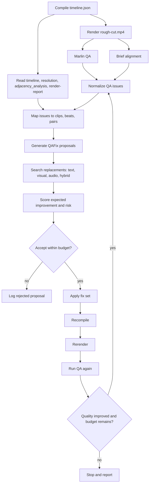

# Design: QA Improvement Loop For The Editorial Pipeline

Date: 2026-06-20
Status: Design only
Scope: Automated render -> QA -> fix proposal -> bounded apply -> recompile -> rerender -> QA loop for rough cuts
Non-goals: No code in this change, no canonical schema churn in phase 1, no remote model dependency, no BGM sync repair

## 1. Executive Decision

Add a bounded QA improvement loop after the existing compile and render steps. The loop should turn current QA reports into structured, deterministic repair proposals, apply only low-risk fixes with measurable expected gain, then recompile and rerender before accepting the iteration.

North star:

```text
weak agents + structure = quality
```

The loop should not ask a stronger general agent to "make the rough cut better." It should do smaller, typed jobs:

- normalize QA findings into repairable issue records
- map timestamps to concrete timeline clips and adjacent pairs
- generate candidate fixes from existing search channels
- score fixes against explicit acceptance gates
- apply a small fix budget
- rerender and rerun QA
- keep an audit trail for every accepted and rejected fix

The first implementation should be report-only, then preview-patch, then artifact-mutating. This avoids turning QA into an opaque second editor before the scoring, rollback, and audit surfaces are proven.

## 2. Existing Surfaces

The design uses the current pipeline and artifact contracts.

| Surface | Current behavior | Role in QA loop |
| --- | --- | --- |
| `runtime/eval/marlin-qa.ts` | Chunks rendered video into 30s spans with 3s overlap, prepares 384px proxy, writes weighted QA score and timestamped issues | Primary post-render issue source |
| `runtime/eval/marlin-qa-types.ts` | Issues have `timestamp_sec`, `duration_sec`, `category`, `severity`, `description`, `suggestion` | Input to normalized issue taxonomy |
| `runtime/eval/brief-alignment.ts` | Scores selects and blueprint against intent, must-have, emotion, narrative, pacing, and variety axes | Project-level gap detector |
| `runtime/tools/footage-search.ts` | Supports text, semantic, structured, visual, multimodal, and audio modes with score breakdowns | Replacement search and evidence source |
| `runtime/compiler/index.ts` | Deterministic compile from brief, selects, blueprint to `timeline.json`; writes resolution metrics and adjacency analysis | Recompile and safety metrics |
| `runtime/compiler/patch.ts` | Applies `replace_segment`, `trim_segment`, `move_segment`, `insert_segment`, and `remove_segment` to a compiled timeline | Safe preview surface for candidate fixes |
| `scripts/render-rough-cut.ts` | Renders `09_output/rough-cut.mp4` and writes `09_output/render-report.json` | Rerender and duration parity evidence |
| `scripts/editorial-pipeline.ts` | Current `--qa` runs Marlin QA after render and logs the summary | Integration point for the new loop |
| `runtime/agents/unified-editorial-agent.ts` | Owns rough/fine planning and persists selects/blueprint | Optional later producer of artifact-level accepted fixes |
| `05_timeline/adjacency_analysis.json` | Pair-level transition evidence with `visual_coherence_score` and `visual_transition_hint` when available | Continuity issue evidence and scoring |

Design constraints:

- Keep existing QA usable without auto-fix.
- Preserve fail-open behavior when `footage.db`, Qwen rows, CLAP rows, or Marlin QA are missing.
- Prefer additive JSON audit artifacts before widening canonical schemas.
- Do not treat Qwen visual, CLAP audio, E5 text, and FTS scores as one vector space. Fuse only at score level.
- Keep beat semantics primary. Reordering must stay inside a beat unless a blueprint-level policy explicitly allows broader movement.

## 3. Issue Taxonomy And Fixability

The loop should normalize raw QA outputs into a smaller set of issue types. Each issue must carry:

- source report path and report hash
- source issue id
- target timestamp or axis gap
- severity
- target clip id, beat id, and adjacent pair when available
- allowed fix types
- non-fixable reason when no safe automatic action exists

### 3.1 Fixability Table

| Normalized issue | Sources | Automatic fixability | Primary fix types | Notes |
| --- | --- | --- | --- | --- |
| `visual_quality_low` | Marlin `camera_shake`, `dark_exposure`, `weak_content`; segment `visual_quality`; search quality scores | High when target clip maps cleanly and alternatives exist | `swap`, `trim`, `remove` | Prefer swap for critical quality; trim only when issue duration is smaller than clip and enough handles exist |
| `continuity_break` | Marlin `continuity`; `adjacency_analysis.json` low `visual_coherence_score`; repeated non-adjacent scene keys | Medium | `swap`, `insert`, `reorder` | Reorder only within same beat by default; bridge inserts need strict duration budget |
| `pacing_too_fast` | Marlin `pacing.too_fast`; brief `pacing_coherence` gaps; micro events | Medium | `trim`, `remove`, `swap` | Usually lengthen key holds or remove support flashes; avoid global timeline stretch |
| `pacing_too_slow` | Marlin `pacing.too_slow`; brief `pacing_coherence` gaps; render/timeline long holds | Medium | `trim`, `swap`, `remove` | Prefer trimming long low-information clips; swap for higher peak density if available |
| `micro_clip` | Marlin `micro_clip`; timeline clip under `MIN_RENDERABLE_FRAMES` | High | `remove`, `trim` | Skip if explicitly marked as intentional `flash_cut` |
| `visual_variety_low` | Brief `visual_variety_and_focus` gaps; repeated asset/cluster/source ranges | Medium | `swap`, `reorder` | Swap lower-priority repeated support clips, not hero/must-have clips first |
| `must_have_gap` | Brief `must_have_coverage` gaps | Medium when footage exists | `swap`, `insert` | Requires text plus visual hybrid search and beat placement checks |
| `intent_gap` | Brief `intent_message_alignment` gaps | Low to medium | `swap`, `insert` | Only safe when gap maps to concrete terms and replacement has strong evidence |
| `emotion_curve_gap` | Brief `emotion_curve_alignment`; Marlin emotion arc monotony | Low to medium | `swap`, `reorder` | Automatic fixes should be conservative; this is often story-level |
| `audio_continuity_break` | Future QA audio windows; CLAP similarity; LUFS/silence deltas | Medium when CLAP/audio profile exists | `reorder`, `swap`, `trim` | Use only when audio evidence is available; otherwise report-only |
| `duration_or_fill_regression` | Compiler resolution and render report | High detection, low automatic fix | `remove`, `trim`, stop iteration | Mostly a safety gate, not a creative fix source |

### 3.2 Not Automatically Fixable

These should be reported with blocked reasons, not repaired:

- missing footage category when no search candidate exists in the pool
- fundamental narrative structure failure across multiple beats
- BGM sync and beat-grid repair
- missing source media, broken source map, malformed DB, or model cache setup
- line-crossing and spatial continuity when evidence is low confidence
- project-level style disagreement with the brief that cannot map to a clip or beat
- any issue whose proposed fix would reduce must-have coverage or violate `must_avoid`

### 3.3 Severity And Priority

Normalize severity to a stable priority score:

| Raw severity | Base priority |
| --- | ---: |
| `critical` | 1.00 |
| `warning` | 0.65 |
| `info` | 0.25 |

Priority modifiers:

- `+0.20` if the issue is in the first 15% of the timeline
- `+0.15` if the issue targets a hero or hook clip
- `+0.10` if the same clip has multiple issues
- `+0.10` if the issue is also supported by adjacency or brief-alignment evidence
- `-0.25` if the target clip is a must-have carrier
- `-0.30` if the fix requires insert or cross-beat reorder

Sort proposals deterministically by:

```text
priority desc,
severity desc,
timestamp_sec asc,
target_clip_id asc,
issue_id asc
```

## 4. QA -> Fix Pipeline

### 4.1 Flow Diagram



### 4.2 Iteration Inputs

Each iteration should snapshot these inputs before proposing fixes:

```text
01_intent/creative_brief.yaml
04_plan/selects_candidates.yaml
04_plan/edit_blueprint.yaml
04_plan/visual_search_trace.json
05_timeline/timeline.json
05_timeline/adjacency_analysis.json
09_output/render-report.json
latest Marlin QA report
latest brief alignment report
03_analysis/search/footage.db status
```

The snapshot does not need to copy large media. It should record paths, hashes, sizes, and modification times.

### 4.3 Timestamp To Timeline Mapping

For Marlin issues:

1. Read `timeline.json` fps from `sequence.fps_num / fps_den`.
2. Convert `timestamp_sec` to `target_frame = round(timestamp_sec * fps)`.
3. Find the V1 clip where:

   ```text
   clip.timeline_in_frame <= target_frame
   target_frame < clip.timeline_in_frame + clip.timeline_duration_frames
   ```

4. If the timestamp lands in a timeline gap, bind the issue to the nearest adjacent pair and mark `target_surface = "gap_or_cut"`.
5. For continuity issues, also bind the previous and next V1 clips around the timestamp.
6. If no clip maps, mark the issue `unmapped` and keep it report-only.

For brief-alignment gaps:

1. `must_have_coverage`: map missing terms to beat ids using `beat.purpose`, `required_roles`, candidate `eligible_beats`, and search results.
2. `visual_variety_and_focus`: map to repeated asset, repeated source range, repeated cluster, or low-focus candidate set.
3. `pacing_coherence`: map to long/short clip clusters and compiler resolution metrics.
4. `narrative_structure` and `emotion_curve_alignment`: map only when a concrete missing story role or beat function is named. Otherwise report-only.

### 4.4 Proposal Generation

For each normalized issue, generate at most three candidate fixes. Deduplicate by:

```text
issue_id + fix_type + target_clip_id + replacement.segment_id
```

The proposal generator should prefer the smallest safe fix:

1. `trim` when the problem is local inside a clip and source handles exist.
2. `swap` when the whole clip is weak or a requirement is missing.
3. `reorder` when the same set of clips can improve a pair within a beat.
4. `insert` only when a bridge or must-have cannot replace a weaker clip without losing coverage.
5. `remove` only for micro-clips, duplicate low-value clips, or timeline safety.

## 5. Fix Proposal Interface And Scoring

### 5.1 Core Interface

The requested `QAFix` interface is the right outer contract. Add evidence and applicability fields around it rather than changing the core shape.

```ts
export type QAIssueType =
  | "quality"
  | "continuity"
  | "pacing"
  | "variety"
  | "must_have"
  | "intent"
  | "emotion"
  | "audio_continuity"
  | "duration";

export type QAFixType =
  | "swap"
  | "reorder"
  | "trim"
  | "insert"
  | "remove";

export interface QAFix {
  issue_id: string;
  issue_type: QAIssueType;
  fix_type: QAFixType;
  target_clip_id: string;
  target_beat_id: string;
  timestamp_sec: number;
  replacement?: {
    segment_id: string;
    search_mode: "visual" | "audio" | "text" | "hybrid" | "multimodal";
    search_score: number;
    reason: string;
  };
  expected_improvement: number;
  risk: "low" | "medium" | "high";
}
```

### 5.2 Proposed Wrapper

The actual persisted proposal should include audit fields:

```ts
export interface QAFixProposal {
  version: "1";
  proposal_id: string;
  iteration: number;
  fix: QAFix;
  source: {
    marlin_qa_report?: string;
    brief_alignment_report?: string;
    adjacency_analysis?: string;
    timeline_path: string;
  };
  target: {
    clip_id: string;
    segment_id: string;
    asset_id: string;
    beat_id: string;
    src_in_us: number;
    src_out_us: number;
    timeline_in_frame: number;
    timeline_duration_frames: number;
    role?: string;
    story_role?: string;
  };
  evidence: Array<{
    channel: "marlin_qa" | "brief_alignment" | "visual_search" | "audio_search" | "text_search" | "adjacency" | "compiler" | "render";
    metric?: string;
    value: string | number | boolean;
    weight?: number;
  }>;
  scoring: {
    issue_priority: number;
    retrieval_gain: number;
    quality_gain: number;
    continuity_gain: number;
    coverage_gain: number;
    pacing_gain: number;
    diversity_gain: number;
    risk_penalty: number;
    expected_improvement: number;
  };
  status: "proposed" | "accepted" | "rejected" | "applied" | "reverted";
  rejection_reason?: string;
}
```

### 5.3 Proposal IDs

Make proposal IDs deterministic:

```text
QAFIX_ + first_12_hex(sha256(
  project_id + iteration + issue_id + fix_type + target_clip_id + replacement_segment_id_or_empty
))
```

This prevents noisy diffs and makes repeated runs comparable.

### 5.4 Expected Improvement Formula

Use a transparent weighted score, not an agent judgment:

```text
expected_improvement =
  0.25 * issue_priority
+ 0.20 * retrieval_gain
+ 0.15 * quality_gain
+ 0.15 * continuity_gain
+ 0.10 * coverage_gain
+ 0.10 * pacing_gain
+ 0.05 * diversity_gain
- risk_penalty
```

Clamp to `0..1`.

Metric definitions:

| Component | How to compute |
| --- | --- |
| `issue_priority` | Normalized severity and timeline-position priority from section 3.3 |
| `retrieval_gain` | Replacement search score minus target baseline, using the same channel when possible |
| `quality_gain` | Replacement `composition_score`, `subject_prominence`, `motion_quality`, and fewer quality flags vs target |
| `continuity_gain` | Pair coherence improvement from Qwen visual similarity, adjacency evidence, and same-session/source hints |
| `coverage_gain` | Must-have or intent gap matched by replacement evidence |
| `pacing_gain` | Distance toward target clip duration, minimum renderable frames, beat fill, or Marlin average-event target |
| `diversity_gain` | Lower repeated asset/cluster/source ratio while preserving beat role |
| `risk_penalty` | Penalty from section 5.5 |

### 5.5 Risk Classification

| Risk | Conditions |
| --- | --- |
| `low` | Same beat, same role, replacement has better or equal quality, no duration/fill regression predicted, no must-have loss |
| `medium` | Insert/remove, replacement role differs but beat role still satisfied, continuity evidence is partial, or duration impact needs compile verification |
| `high` | Cross-beat reorder, target is hero/hook/must-have carrier, replacement search score is marginal, or audio/video mirror resync is required |

Default risk penalties:

```text
low: 0.00
medium: 0.15
high: 0.35
```

Reject high-risk fixes automatically in phase 1 and phase 2. They can be logged for human review.

### 5.6 Acceptance Gates

A proposal can be accepted only when all gates pass:

- `expected_improvement >= 0.20`
- `risk != "high"`
- target clip maps to V1 or a supported audio mirror case
- replacement is not already selected unless the fix is intentional reorder
- replacement does not violate `must_avoid`
- replacement has a usable source range and at least `MIN_RENDERABLE_FRAMES`
- replacement keeps or improves required beat role coverage
- expected duration delta stays inside per-iteration budget
- search response has no blocking channel warnings for the channel being used

## 6. Applying Fixes

### 6.1 Two Application Modes

Use two modes so the loop can be proven safely.

| Mode | Writes | Purpose |
| --- | --- | --- |
| `preview_patch` | `06_review/qa_improvement_loop/iteration-XX/review_patch.json` plus audit | Apply fixes to compiled timeline through `runtime/compiler/patch.ts` for quick QA comparison |
| `artifact_commit` | `04_plan/selects_candidates.yaml` and/or `04_plan/edit_blueprint.yaml` plus audit | Persist accepted fixes so a fresh compile reproduces them |

Phase 1 should implement only report generation. Phase 2 should use `preview_patch`. Phase 3 can add `artifact_commit`.

Why both modes exist:

- `reviewPatch` already supports replace, trim, move, insert, and remove against `timeline.json`.
- Preview patch is ideal for measuring whether a fix improves QA.
- Artifact commit is needed for durable pipeline output, because a fresh compile from unchanged selects/blueprint would otherwise lose the patch.

### 6.2 Mapping `QAFix` To Review Patch

| `QAFix.fix_type` | Review patch op | Required data |
| --- | --- | --- |
| `swap` | `replace_segment` | `target_clip_id`, `replacement.segment_id` that exists in candidates |
| `trim` | `trim_segment` | `target_clip_id`, `new_src_in_us`, `new_src_out_us` |
| `reorder` | `move_segment` | `target_clip_id`, `new_timeline_in_frame`, optional `new_duration_frames` |
| `insert` | `insert_segment` | `replacement.segment_id`, `new_timeline_in_frame`, `new_duration_frames`, `beat_id`, `role` |
| `remove` | `remove_segment` | `target_clip_id` |

For `swap` and `insert`, the replacement must exist in `selects_candidates.yaml`. If search returns a segment that is not a candidate, phase 2 should either reject it or add a proposed "candidate materialization" step for phase 3.

### 6.3 Artifact Commit Rules

Accepted fixes that survive rerender QA should be made durable by editing planning artifacts:

| Fix type | Durable artifact change |
| --- | --- |
| `swap` | Promote replacement segment to a candidate with same role/story role/eligible beat, demote or reject target candidate, preserve evidence |
| `trim` | Update candidate `src_in_us` / `src_out_us` or `trim_hint` when the compiler can honor it deterministically |
| `reorder` | Prefer blueprint beat or candidate-plan adjustments over direct timeline positions |
| `insert` | Add/promote replacement candidate and assign eligible beat; adjust beat required/preferred roles only if already compatible |
| `remove` | Mark candidate `role: reject` or remove only if schema and downstream loaders allow stable omission |

Rules:

- Do not mutate `segments.json`, `assets.json`, `footage.db`, or schemas.
- Preserve unknown fields in YAML.
- Validate artifacts with existing loaders/schemas after mutation.
- Keep a before/after hash for every touched artifact.

## 7. Search-To-Fix Mapping

Use existing `runtime/tools/footage-search.ts` modes and score breakdowns.

| Fix type | Search used | Query shape | Evidence needed | Acceptance signal |
| --- | --- | --- | --- | --- |
| Visual quality swap | Qwen visual anchor plus quality filters | `mode: "visual"`, `visual_anchor: { segment_id: target }`, exclude selected ids, `quality_min` | Higher quality scores, fewer quality flags, strong `qwen_visual` | Replacement is visually related enough but technically better |
| Weak content swap | Hybrid text/visual | `mode: "hybrid"` or `multimodal`, query from beat purpose and target summary | Search score, peak evidence, beat role match | Better peak/quality with same beat purpose |
| Continuity bridge | Qwen visual from both sides | Two visual searches anchored on left and right; rank by min or harmonic mean | Similarity to both neighbors, same scene/session hints, low risk | Pair coherence improves on both cuts |
| Continuity reorder | Qwen visual cache plus adjacency analysis | No external search required; evaluate permutations inside beat | `visual_coherence_score`, source order/session/camera hints | Total pair score improves and beat order remains valid |
| Audio continuity | CLAP audio or text-to-audio plus audio profile | `mode: "audio"` with `audio_query_path` when available, or text query for ambience | `audio_similarity`, LUFS/silence deltas, ambient/music flags | Similar sound bed and no level/silence jump |
| Must-have coverage | Text plus visual hybrid | `mode: "hybrid"` or `multimodal`, query missing must-have term plus context | Brief gap, FTS/E5/Qwen text, visual evidence, evidence refs | Missing term becomes covered without losing existing coverage |
| Variety improvement | Structured plus visual diversity | `unusedFootage` with selected exclusions; optional visual dissimilarity post-score | Different asset/cluster, quality above floor, beat role match | Variety axis improves and continuity does not regress |
| Pacing too fast | Usually no search; optional longer replacement | Candidate handles, duration target, source duration | Longer readable source range, same beat role | Average event/clip duration moves toward target |
| Pacing too slow | Hybrid search for stronger/shorter clip | `bestForBeat` with beat purpose and role, max duration filter | Higher peak/quality density, shorter duration | Long low-information hold is shortened or replaced |
| Micro-clip | No search by default | Timeline and craft markers | Clip duration, flash-cut marker absence | Clip removed or extended above renderable minimum |

### 7.1 Channel Rules

- Text/semantic search remains responsible for spoken topics and must-have wording.
- Qwen visual search is responsible for visual replacement, shot similarity, bridge clips, and visual variety.
- CLAP audio search is responsible for ambience, room tone, music/source sound, and audio continuity when rows exist.
- Structured filters are used as gates: duration, quality, audio flags, camera metadata, selected exclusions.
- Search warnings must be copied into proposal evidence. A proposal that depends on an unavailable channel must be rejected.

### 7.2 Replacement Ranking

After search returns candidates, rerank deterministically:

```text
replacement_score =
  0.35 * search_final_score
+ 0.20 * channel_specific_score
+ 0.15 * quality_score
+ 0.10 * beat_role_match
+ 0.10 * duration_fit
+ 0.05 * novelty_or_continuity_score
+ 0.05 * evidence_confidence
- 0.20 * selected_duplicate_penalty
- 0.15 * same_problem_penalty
```

Use `qwen_visual` as the channel-specific score for visual fixes, `audio_similarity` for audio fixes, and the existing semantic/lexical fields for text fixes.

## 8. Convergence And Safety

### 8.1 Iteration Limits

Recommended defaults:

```text
max_iterations: 3
max_fixes_per_iteration: 4
max_swaps_per_iteration: 2
max_inserts_per_iteration: 1
max_total_duration_delta_sec_per_iteration: 8
min_expected_improvement: 0.20
min_overall_score_delta_to_continue: 2 Marlin QA points or 0.02 brief composite
```

### 8.2 Stop Conditions

Stop the loop when any condition is true:

- max iterations reached
- no accepted fix proposals remain
- Marlin QA score decreases after an iteration
- brief alignment composite decreases by more than `0.03`
- compiler `duration_fit` changes from true to false
- compiler `content_fill_ratio` decreases by more than `0.05`
- render parity fails in `09_output/render-report.json`
- any critical issue count increases
- the same issue id survives two accepted fixes
- required search channel is unavailable

Quality floor:

```text
Do not keep an iteration whose combined quality score is lower than the previous accepted iteration.
```

Combined quality score:

```text
combined_quality =
  0.50 * normalized_marlin_qa_score
+ 0.30 * brief_alignment_composite
+ 0.10 * content_fill_ratio
+ 0.10 * render_parity_score
- 0.05 * critical_issue_count
```

Where:

- `normalized_marlin_qa_score = marlin.score / 100`
- `render_parity_score = 1` when parity passes, else `0`
- `critical_issue_count` is clamped to `0..1` after dividing by 5

### 8.3 Rollback

Every iteration must be reversible:

- keep before/after hashes for `selects_candidates.yaml`, `edit_blueprint.yaml`, `timeline.json`, and `rough-cut.mp4`
- retain the last accepted render and reports
- if a new iteration fails a stop condition, restore the previous accepted planning artifacts in artifact-commit mode
- in preview-patch mode, discard the patch and keep the original planning artifacts untouched

### 8.4 Determinism

The same QA input should produce the same proposal set when search artifacts are unchanged.

Requirements:

- sort all files, issues, clips, and search results before processing
- use deterministic proposal ids
- cap search results with stable limits
- record DB status and embedding channel availability
- do not call LLMs for proposal scoring
- if brief alignment uses LLM judge mode, record that report as an input; do not rerun it inside proposal generation unless the iteration explicitly requests a new QA pass

### 8.5 Audit Trail

Write one directory per iteration:

```text
06_review/qa_improvement_loop/
  iteration-001/
    qa_inputs.json
    normalized_issues.json
    qa_fix_proposals.json
    accepted_fixes.json
    rejected_fixes.json
    review_patch.json
    before_scores.json
    after_scores.json
    iteration_summary.md
  loop_summary.json
  loop_summary.md
```

`loop_summary.md` should report:

- iterations attempted
- fixes proposed, accepted, rejected, applied, reverted
- before/after Marlin score
- before/after brief composite
- before/after critical/warning/info issue counts
- before/after content fill and render parity
- top remaining issues
- blocked issues with reasons

## 9. Pipeline Integration Sketch

### 9.1 Current Flow

Current `scripts/editorial-pipeline.ts`:

```text
visual retrieval
-> rough pass
-> write selects/blueprint
-> optional fine pass
-> compile
-> render
-> optional Marlin QA report
```

### 9.2 Proposed Flow

Add a new optional loop after render:

```text
visual retrieval
-> rough pass
-> fine pass
-> compile
-> render
-> QA loop:
   -> Marlin QA
   -> brief alignment
   -> normalize issues
   -> propose fixes
   -> apply bounded fixes
   -> recompile
   -> rerender
   -> QA again
   -> accept/revert iteration
-> final output
```

Suggested CLI shape:

```text
npx tsx scripts/editorial-pipeline.ts --project <dir> --qa
npx tsx scripts/editorial-pipeline.ts --project <dir> --qa-loop report
npx tsx scripts/editorial-pipeline.ts --project <dir> --qa-loop preview-patch
npx tsx scripts/editorial-pipeline.ts --project <dir> --qa-loop artifact-commit
```

Default should remain no auto-fix. `--qa` should remain report-only for backward compatibility.

### 9.3 New Runtime Modules

Suggested module boundaries:

| Module | Responsibility |
| --- | --- |
| `runtime/eval/qa-issue-normalizer.ts` | Convert Marlin and brief-alignment reports into normalized issues |
| `runtime/eval/qa-timeline-map.ts` | Map issues to clips, beats, gaps, and adjacent pairs |
| `runtime/eval/qa-fix-proposer.ts` | Generate deterministic `QAFixProposal` records |
| `runtime/eval/qa-fix-search.ts` | Call `searchFootage`, `similarFootage`, `unusedFootage`, and `bestForBeat` for fixes |
| `runtime/eval/qa-fix-score.ts` | Compute expected improvement and risk |
| `runtime/eval/qa-fix-apply.ts` | Convert accepted proposals to review patch or artifact edits |
| `runtime/eval/qa-loop.ts` | Orchestrate iterations, stop rules, audit writes, rollback |

Keep these under `runtime/eval` because the loop is evaluation-driven and should not become part of the deterministic compiler core.

### 9.4 Agent Integration

`runtime/agents/unified-editorial-agent.ts` should not own the QA loop in phase 1. It can later expose a constrained "repair planning" pass if artifact-commit mode needs better blueprint edits.

Recommended split:

- deterministic QA loop owns issue mapping, search, scoring, budget, and audit
- compiler owns deterministic timeline assembly and safety resolution
- unified editorial agent may propose higher-level blueprint revisions only for non-automatic issues

## 10. Phased Implementation Plan

### Phase 0: Design And Fixtures

Deliverables:

- this design doc
- fixture examples of Marlin QA, brief alignment, timeline, adjacency analysis, and search result inputs
- expected normalized issue and proposal JSON examples

Acceptance:

- no runtime behavior changes
- fixture documents cover quality, continuity, pacing, variety, and must-have cases

### Phase 1: Report-Only Proposal Engine

Deliverables:

- issue normalizer
- timestamp-to-clip mapper
- proposal generator
- deterministic proposal scoring
- audit files under `06_review/qa_improvement_loop`

No fixes are applied.

Acceptance:

- given fixed QA reports and timeline, proposals are byte-stable
- unmapped and non-fixable issues are reported with reasons
- search-channel warnings are visible in proposals

### Phase 2: Preview Patch Loop

Deliverables:

- convert accepted proposals to `review_patch.json`
- compile with `reviewPatch`
- render preview output
- rerun Marlin QA and brief alignment
- accept or reject iteration by quality floor

Acceptance:

- planning artifacts remain unchanged
- failed iteration leaves original output intact
- loop stops on score decrease, duration/fill regression, or critical issue increase

### Phase 3: Artifact Commit Mode

Deliverables:

- durable edits to `selects_candidates.yaml` and limited blueprint fields
- schema validation after mutation
- rollback from artifact hashes
- summary of persistent changes

Acceptance:

- fresh compile without review patch reproduces accepted fix intent
- unknown YAML fields are preserved
- no changes to `segments.json`, DB schema, or timeline schema

### Phase 4: Continuity And Audio Expansion

Deliverables:

- better within-beat reorder search using visual coherence
- bridge-clip search against both sides
- CLAP/audio-profile continuity fixes when audio rows exist
- audio-window extraction for actual timeline cut points if needed

Acceptance:

- audio fixes are skipped when CLAP rows or audio windows are unavailable
- visual continuity gains do not regress duration/fill metrics
- nat-sound mirrors remain synchronized after reorder/trim fixes

### Phase 5: Human Review And Policy Controls

Deliverables:

- optional human approval gate for medium-risk fixes
- project policy fields for max iterations/fix budgets
- report UI or command output summary

Acceptance:

- high-risk proposals are never auto-applied
- human-approved fixes carry explicit approval evidence in audit

## 11. Test Plan

### 11.1 Unit Tests

Issue normalization:

- maps Marlin `camera_shake` to `visual_quality_low`
- maps Marlin `dark_exposure` to `visual_quality_low`
- maps Marlin `micro_clip` to `micro_clip`
- maps brief `must_have_coverage` gaps to `must_have_gap`
- leaves narrative-wide gaps report-only when no beat/clip mapping exists

Timeline mapping:

- maps timestamp inside clip to correct `clip_id`
- maps timestamp in gap to adjacent pair
- handles fps from timeline sequence
- handles missing or malformed timeline as report-only

Proposal scoring:

- deterministic sort order
- high-risk hero replacement is rejected
- unavailable search channel rejects dependent proposal
- must-have carrier is protected from low-gain replacement
- expected improvement is clamped to `0..1`

Patch conversion:

- swap -> `replace_segment`
- trim -> `trim_segment`
- reorder -> `move_segment`
- insert -> `insert_segment`
- remove -> `remove_segment`
- replacement missing from candidates is rejected

### 11.2 Integration Tests

Report-only mode:

- fixed fixture inputs produce stable `qa_fix_proposals.json`
- audit includes accepted/rejected reasons without writing plan artifacts

Preview-patch mode:

- applies a low-risk replacement to compiled timeline
- reruns compile resolution
- rejects iteration when Marlin score decreases
- rejects iteration when `content_fill_ratio` regresses past threshold
- rejects iteration when render parity fails

Artifact-commit mode:

- updates selects candidate role/trim fields and validates schema
- fresh compile reproduces accepted replacement
- rollback restores previous hashes after failed QA iteration

Search integration:

- visual replacement uses `visual_anchor` and excludes selected ids
- audio proposal is skipped when CLAP rows are missing
- must-have proposal uses text/hybrid evidence refs
- fallback `segments.json` search creates lower-confidence proposals or report-only warnings

### 11.3 Golden-Style Project Tests

Use small fixture projects with synthetic media/timeline artifacts:

- micro-clip removal closes timeline gap and keeps renderable duration
- weak clip replacement improves QA score without losing beat role
- continuity reorder improves adjacency pair score inside a beat
- must-have insertion is rejected when duration budget is exceeded
- visual variety swap does not replace hook/hero clips unless explicitly allowed

### 11.4 Real Project Verification

For a real project run, verify:

- `timeline.json` V1 clip count and beat coverage
- `adjacency_analysis.json` before/after pair scores
- `render-report.json` parity and content/gap accounting
- Marlin QA before/after score and issue counts
- brief alignment before/after composite and axis scores
- search traces or proposal evidence for every applied replacement
- `ffprobe` duration of final `rough-cut.mp4`

Render success alone is not sufficient.

## 12. Risks

| Risk | Impact | Mitigation |
| --- | --- | --- |
| QA model false positives | Good clips get replaced | Require issue plus timeline/search evidence; keep first phase report-only |
| Search finds visually similar but narratively wrong clips | Story coherence regresses | Gate by beat role, must-have preservation, brief terms, and fresh brief alignment |
| Continuity optimization hurts duration/fill | Render looks shorter or sparse | Track `content_fill_ratio`, gap count, duration fit, render parity as hard stop rules |
| Reorder breaks nat-sound mirrors | Audio/video drift | Keep reorders inside compiler-aware paths; verify audio mirror resync before enabling automatic reorder |
| Artifact edits become schema churn | Existing projects break | Phase 1 uses audit JSON; phase 2 uses review patch; phase 3 edits only existing YAML fields |
| BGM sync is misclassified as pacing | Loop applies wrong fixes | Keep BGM sync out of automatic fixability; report separately |
| Missing embeddings block improvements | Loop appears broken | Fail open with explicit unavailable-channel warnings and text/structured fallback proposals |
| High-risk fixes accumulate | Rough cut changes too much | Max fixes per iteration, max swaps/inserts, score floor, rollback, and human gate for medium/high risk |
| Determinism drifts due to report timestamps or search DB changes | Audits become noisy | Hash inputs, sort all records, store DB status and report paths, and keep proposal IDs content-derived |
| Must-have coverage improves while visual quality worsens | Single-axis optimization | Use combined quality score and axis-specific no-regression gates |

## 13. Open Decisions

These should be settled before implementation, not hidden in code defaults:

| Decision | Recommendation | Needed before |
| --- | --- | --- |
| Default CLI flag | Add `--qa-loop report` first; keep `--qa` unchanged | Phase 1 |
| Proposal artifact schema | Start as internal JSON with version `"1"`; add formal schema after fixtures stabilize | Phase 1 |
| Artifact commit authority | Require explicit `--qa-loop artifact-commit` | Phase 3 |
| Medium-risk fixes | Report-only until human approval flow exists | Phase 5 |
| Audio continuity windows | Use existing CLAP rows first; add trim-aware windows only after visual loop works | Phase 4 |

## 14. Success Criteria

The loop is successful when it can repeatedly show:

- lower critical/warning issue counts after accepted iterations
- stable or improved Marlin QA score
- stable or improved brief alignment composite
- no duration/fill/render parity regression
- every applied fix has search or deterministic evidence
- every rejected fix has a concrete reason
- rerunning with the same inputs produces the same proposals

The output should be a better rough cut, but the implementation standard is stricter:

```text
Every improvement must be traceable to a typed issue, a bounded fix, and a measured before/after result.
```
